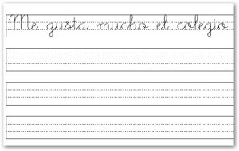
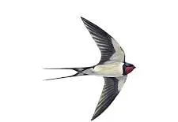
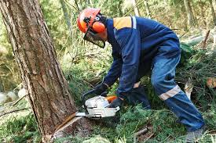
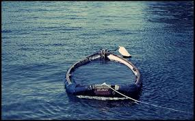
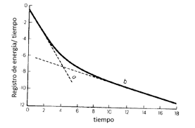

*- mode: org; coding: utf-8 -*-
#+STARTUP: showall
#+PROPERTY: DICTIONARY es_ES

#+begin_src emacs-lisp :eval no
(shell-command "hunspell -D")
#+end_src

La Sombra del Viento", de Carlos Ruiz Zafón, narra la historia de Daniel Sempere, un joven que descubre en el Cementerio de los Libros Olvidados un ejemplar del misterioso libro "La Sombra del Viento" de Julián Carax. Fascinado por la obra, Daniel se adentra en la investigación de la vida del autor y descubre que alguien ha estado destruyendo sistemáticamente todos los ejemplares de sus libros. A medida que explora la historia de Carax, Daniel se enfrenta a secretos oscuros, pasiones prohibidas y peligros ocultos en la Barcelona de la posguerra, en una trama que combina misterio, amor y venganza, revelando cómo el pasado puede marcar profundamente el presente.

* To be sorted
** verbos de algo
lo la los las
comer tener querer comprar leer
- Imperativo e infinitivo (después y junto)
Comprar los tomates
Cómpralos Cortalos 
- El resto (delante y separado)
Los compro
Tenía una bici
La tenía

** verbos a alguien
me te lo las nos os la las
(no es posible con alguien, en alguien)

Matar, besar, amar, odiar, ayudar, abrazar, invitar
Matar (tú) a mi abulea: Mátala
Mato a mi abuela: La mato
Matáis (a mí) Me matáis
Mateo (besar) a nosotros Besanos Mateo nos besa.
Paul (invitar) a tú a un restaurante. Paul te invita
Nosotros (ayudar) a Elena el hospital la ayudamos
Ayudar (vosotros) a Elena Ayudadla

** verbos algo a alguien
- Indirect
me te le  nos os les
- Direct 
lo/la los/las 
se

Decir, comprar, regalar, robar, gritar, pedir, enseñar, 
Comprar los tomates a mi abuela
Los compro a mi abuela  Cómpralos a mi abuela
Le compra tomates a mi abuela Cómprale los tomates
Los compro a mi abuela
Se los compro  Cómpraselos

Dimelo (Dar (tú) un secreto a mí

Sin tregua Sin descanso, sin pausas.
Hasta la bola Muy, muy lleno de gente. (Coloquial).
Se echan a la calle Salir todos a la vez con mucha energía y ganas de disfrutar.
A la aventura Hacer algo sin tener un plan fijo, improvisando sobre la marcha.
Fue una odisea Algo que fue muy difícil, complicado o que llevó mucho tiempo.
Vaya tela Expresión para enfatizar que algo es increíble, sorprendente o un poco desesperante.
Estamos deseando Tener muchísimas ganas de que algo ocurra.

apuntar
caducar una patente
dar el reconocimiento
inscribir una idea
inventar
reconocer - el mérito de alguien - el trabajo de alguien
ser iniciador(a)
ser pionero/a
ser precursor(a)
patentar una idea
programar
registrar una idea
valorar la autoría
vencer una patente

comercializar
desbancar a alguien
etiquetar
seguir a alguien en las redes
ser de carne y hueso
tener conciencia social impacto
el avatar
los CGI (imágenes generadas por computadora)
la competencia
la dimanión mundial
el/la humanoide
el/la influencer virtual
la naturalidad
el perfil
la red
el/la seguidor(a)
la tecnología 3d

alimentarse
descansar
hidratarse
reproducirse
respirar
el afecto
la amistad
la confianza
la espontaneidad
el éxito
la intimidad sexual
la moralidad
el reconocimiento
la resolución de problemas
la seguridad de empleo / de recursos / de propiedad privadad / de salud / familiar / fisica / moral

emocionarse
hojear un libro
ser recomendable
el ensayo
la ficción
la ilustración
la lectura obligada
la novela gráfica
el poema
la portada
la reseña
el título

constatar
dejarse llevar por algo
el anhelo
le célula
la constatación
la contradicción
el decalmiento
la desilusión
el elixir
el envejecimento
la especie humana
la esperanza
la etapa de la vida
el flujo del tiempo
la longevidad
la nostalgía
las neuvas generaciones
el pesimismo
el porvenir
la temporalidad
el tiempo biológico
la responabilidad colectiva
la vivencia
la vulnerabilidad

compartir la vida con alguien
comprometerse
convenir
costar la vida
dar explicaciónes
dejar perplejo/a
hacer algo sin motivo aparante
hacer feliz a alguien
ir de duro/a
llevar la procesión por dentro
mandar emoticones
mantener una relación estable
mostrarse cariñoso/a
pasar de una cosa a otra
proclamar algo
sentirse correspondido/a
sentirse incompleto/a
ser vulnerable
la alergia al compromiso
el/la amante
el amor arrebatado
el amor poético
el amor torturado
la carencia
la debilidad
el dráma
el fracaso
la indiferencia
la media naranja
el miedo al compromiso
la monagamia
las ojeras
el pánico as ridídulo
la pareja
la pasión
la poligamia
el portal de ligues
la relación estable
el reproche
la vulnerabilidad

pegarse la manera de hablar
perder el acénto
pronunciar
sesear
el acento caribeño
el acento de la península
el acento neutro
el/la compatriota
la entonación

1. Muchas personas tienen una buena opinión y otra es un mal opinión
otras tienen una mala opinión

amigo triste  - buen amigo  (buen es mas importante).   amigo bueno tiene buen corazon amable pero buen amigo es mi "besty"

2.   El sueldo en la universidad es muy bien, pero en el colegio no es el mismo.
bueno esta bien   / lo mismo  
   
          3          Mi abuela me enseñé a cocinar.
enseñó
          
          4          Prefiero una persona que remane tranquila en los proyectos de estrés.
a alguien que se mantenga  estresantes con mucho estres
permanezca - (se queda tranquila - recuperar) 
          
          5          Estoy capaz de hacer ningún cálculo.   Soy capaz     cualquier (no soy capaz.....ningun) No tengo la capacidad
          6          No me gusta tan mucho.
          no tan  No me gusta mucho No me gusta tanto   tan para comparar
          7          Tal vez la situación se va a cambiar.  cambie
          cambiarse = voy a cambiarme
          8          Cada uno tiene su propiedad, somos muy distintos.
propia manera de ser/ sus características

[darselas de]
Luis siempre [dándoselas de] culto y no sabe ni quién escribió El Quijote.
[fanfarron]
El nuevo no deja de decirnos lo que tenemos que hacer y cómo tenemos que hacerlo. Ya [se las da] de jefe ¡y acaba de llegar!
No es por [darmelas de ] listo, pero creo que te estás equivocado

[hacer como que]
Está haciendo [como que escucha] pero en realidad está pensado en sus cosas
[Hice como que] miraba una escaparate para no tener que saludarla
[fingiste interes en la tienda]
Ahora, tengo que [hacer como que] me sorprendo
[Hacer como si uses subjunctive]
;https://www.youtube.com/watch?v=ZJmj4PCMvH

[Vaya a ser que]
[por si acaso]
Sí, me lo llevo, [vaya a ser que] por la noche refresque
Estoy preocupado. Voy a llamarla [vaya a ser que] le haya pasado algo

[por más que]
[darse contra un muro]
Estoy desesperado con esta asignature. [Por más que] no consigo entender nada
Es inútil hablar con él. [Por más que] le doy argumentos de peso no cambia de opinión
Quiero ser optimista, pero [por más que] lo intento, no consigo dejar de preocuparme

** verb frase                                                  :drill:leech:
:PROPERTIES:
:ID:       b845bfc3-f0c4-41ec-9f21-274a13b74a25
:DRILL_LAST_INTERVAL: 0.0
:DRILL_REPEATS_SINCE_FAIL: 1
:DRILL_TOTAL_REPEATS: 17
:DRILL_FAILURE_COUNT: 16
:DRILL_AVERAGE_QUALITY: 1.823
:DRILL_EASE: 2.36
:DRILL_LAST_QUALITY: 2
:DRILL_LAST_REVIEWED: [Y-03-17 Tue 16:%]
:END:
 Quiero [recomendar encarecidamente] que dejemos que las dudas se hagan oír y que escuchemos lo que las pequeñas y medianas
También deseo [recomendar encarecidamente] a la Comisión que busque formas de garantizar que canales como Euronews y Arte florezcan y se desarrollen.
[[./img/recomendarencarecidamente.jpeg]]

** Frase :drill:
SCHEDULED: <2026-03-27 Fri>
:PROPERTIES:
:ID:       dc2c3fcd-192a-49cb-b46d-54813d9b0a6a
:DRILL_LAST_INTERVAL: 10.3376
:DRILL_REPEATS_SINCE_FAIL: 3
:DRILL_TOTAL_REPEATS: 6
:DRILL_FAILURE_COUNT: 3
:DRILL_AVERAGE_QUALITY: 2.833
:DRILL_EASE: 2.46
:DRILL_LAST_QUALITY: 3
:DRILL_LAST_REVIEWED: [Y-03-17 Tue 16:%]
:END:
[ir a mi bola]
Id vosotros. Yo voy [ir a mi bola]. Aprovecharé el tiempo que dura la película para hacer unas compras
Javier nunca viene a las comidas de empresa. Él prefiere [ir a su bola]

** Frase :drill:
SCHEDULED: <2026-04-19 Sun>
:PROPERTIES:
:ID:       634c5c9a-019e-4c94-bc77-0e8196f6872d
:DRILL_LAST_INTERVAL: 23.3037
:DRILL_REPEATS_SINCE_FAIL: 4
:DRILL_TOTAL_REPEATS: 17
:DRILL_FAILURE_COUNT: 14
:DRILL_AVERAGE_QUALITY: 2.176
:DRILL_EASE: 2.22
:DRILL_LAST_QUALITY: 3
:DRILL_LAST_REVIEWED: [Y-03-27 Fri 10:%]
:END:
[no está el horno para bollos]
Quería pedirle un aumento de sueldo a mi jefe, pero acaban de anunciar pérdidas en la empresa, así que mejor, me espero un poco porque ahora mismo no está el horno para bollos]
LLegué a casa y vi a mis padres discutiendo. Quería proponerles probar un nuevo restaurante que han abierto per no [estaba el horno para bollos]. Prefiero proponérselo otro día.

** noun :drill:
SCHEDULED: <2026-03-31 Tue>
:PROPERTIES:
:ID:       a13f9dd5-7e47-49d9-93f5-cdd89890738d
:DRILL_LAST_INTERVAL: 3.995
:DRILL_REPEATS_SINCE_FAIL: 2
:DRILL_TOTAL_REPEATS: 7
:DRILL_FAILURE_COUNT: 4
:DRILL_AVERAGE_QUALITY: 2.429
:DRILL_EASE: 2.46
:DRILL_LAST_QUALITY: 4
:DRILL_LAST_REVIEWED: [Y-03-27 Fri 10:%]
:END:
 Este análisis no está inspirado por [la añoranza] de un pasado utópico.
Clavados en la pared, el extrañamiento cósmico y [la añoranza] del mundo junto a fotos de viaje y antes curiosos.

** frase :drill:
SCHEDULED: <2026-03-31 Tue>
:PROPERTIES:
:ID:       50ee077f-78b3-4f33-94b2-ffd5bb6cc76d
:DRILL_LAST_INTERVAL: 3.725
:DRILL_REPEATS_SINCE_FAIL: 2
:DRILL_TOTAL_REPEATS: 18
:DRILL_FAILURE_COUNT: 14
:DRILL_AVERAGE_QUALITY: 1.721
:DRILL_EASE: 1.94
:DRILL_LAST_QUALITY: 3
:DRILL_LAST_REVIEWED: [Y-03-27 Fri 11:%]
:END:
[estar metido/a en el ajo]
¡Oye, que yo también quiero [estar metida en el ajo]! Decidme cómo puedo ayurdaros.
¡mmm así que vosotros [estabais metidos en el ajo]... !

** frase :drill:
SCHEDULED: <2026-03-27 Fri>
:PROPERTIES:
:ID:       0e2858a1-e4be-44e6-af5d-c04007e988e1
:DRILL_LAST_INTERVAL: 9.9715
:DRILL_REPEATS_SINCE_FAIL: 3
:DRILL_TOTAL_REPEATS: 5
:DRILL_FAILURE_COUNT: 2
:DRILL_AVERAGE_QUALITY: 2.8
:DRILL_EASE: 2.46
:DRILL_LAST_QUALITY: 4
:DRILL_LAST_REVIEWED: [Y-03-17 Tue 16:%]
:END:
[venirse arriba]
Durante gran parte del partido íbamos perdiendo, pero tras el primer gol los jugadores [se vinieron arriba] y acabamos ganado
Inicialmente, quería hacer una boda sencilla, pero [se vino arriba] y terminó organizando una celebración tan espectacular que le generó una importante deuda con el banco

** Frase                                                       :drill:leech:
:PROPERTIES:
:ID:       6ca227ca-f898-43b5-be7b-333545db3877
:DRILL_LAST_INTERVAL: 0.0
:DRILL_REPEATS_SINCE_FAIL: 1
:DRILL_TOTAL_REPEATS: 19
:DRILL_FAILURE_COUNT: 16
:DRILL_AVERAGE_QUALITY: 1.684
:DRILL_EASE: 2.22
:DRILL_LAST_QUALITY: 1
:DRILL_LAST_REVIEWED: [Y-03-27 Fri 10:%]
:END:
[hacerse el sueco]
Le recordé a mi hermano que le tocaba fregar los platos, per [se hizo el sueco] y se subió a su habitación como si no me hubiera oído.
Hoy me he cruzado por la calle con Manolo. Estoy segura de que me vio, pero [se hizo el sueco] porque me debe dinero desde hace bastance tiempo

** Adjective                                                         :drill:
SCHEDULED: <2026-03-31 Tue>
:PROPERTIES:
:ID:       2ee54636-bac0-4c99-91cb-8420b71e87d4
:DRILL_LAST_INTERVAL: 4.285
:DRILL_REPEATS_SINCE_FAIL: 2
:DRILL_TOTAL_REPEATS: 8
:DRILL_FAILURE_COUNT: 5
:DRILL_AVERAGE_QUALITY: 3.0
:DRILL_EASE: 2.7
:DRILL_LAST_QUALITY: 5
:DRILL_LAST_REVIEWED: [Y-03-27 Fri 10:%]
:END:
Esto no quiere decir que uno busca tener un argumento [blandengue], pero tampoco quiere decir que aún con visiones y prácticas
A veces tengo la impresión de la política social se considera de [blandengues]. 

** Frase                                                       :drill:leech:
:PROPERTIES:
:ID:       c2a5236a-2ff2-4e71-b3aa-c3809244b6be
:DRILL_LAST_INTERVAL: 0.0
:DRILL_REPEATS_SINCE_FAIL: 1
:DRILL_TOTAL_REPEATS: 18
:DRILL_FAILURE_COUNT: 16
:DRILL_AVERAGE_QUALITY: 1.446
:DRILL_EASE: 2.22
:DRILL_LAST_QUALITY: 1
:DRILL_LAST_REVIEWED: [Y-03-17 Tue 16:%]
:END:
[ser la gota que colma el vaso]
He aguantado que me jefe me ignorara o incluso que me diera el peor trabajo, pero que me gritara delatne de todo el mundo [ha sido la gota que ha colmado el vaso]. Mañana presente mi dimisión.
Lleva meses descuidando nuestra relación, per que hoy no se acordara de nuestro aniversario [ha sido la gota que ha colmado el vaso]. La verdad es que no quiero continuar con él.

arruinar
estropearse
Los errores durante esta etapa de la investigación podrían arruinar toda la recolección de datos.
Quién sabe cómo se vería afectada Europa, si una cena pudiera estropearse por tan poco! 
No es una medida de seguridad vial, sino un cínico intento de fastidiar a quienes utilizan este medio de transporte.

 Este buscador permite recuperar las páginas y noticias de esta web utilizando operadores, palabras comodín y lenguaje natural.
Tenga en cuenta que no es posible usar caracteres comodín, como * y ? en una búsqueda.

* Sustantivos o adjetivos

** Adjetivo                                                         :drill:
SCHEDULED: <2026-05-14 Thu>
:PROPERTIES:
:ID:       7f93d0fd-1492-427a-83f3-a124f320dbb1
:DRILL_LAST_INTERVAL: 107.4166
:DRILL_REPEATS_SINCE_FAIL: 7
:DRILL_TOTAL_REPEATS: 10
:DRILL_FAILURE_COUNT: 2
:DRILL_AVERAGE_QUALITY: 3.1
:DRILL_EASE: 1.8
:DRILL_LAST_QUALITY: 4
:DRILL_LAST_REVIEWED: [Y-01-27 Tue 12:%]
:END:

El tronco del árbol está [torcido]
Tu corbata está [torcido]
El barco encalló y el timón quedo [torcido]
Como tenía la muñeca [torcida], el alumno no pudo tomar apuntes en clase

** Noun expression                                             :drill:leech:
:PROPERTIES:
:ID:       6f0db158-308c-46de-85b7-d75e230ae793
:DRILL_LAST_INTERVAL: 0.0
:DRILL_REPEATS_SINCE_FAIL: 1
:DRILL_TOTAL_REPEATS: 18
:DRILL_FAILURE_COUNT: 16
:DRILL_AVERAGE_QUALITY: 1.389
:DRILL_EASE: 2.5
:DRILL_LAST_QUALITY: 1
:DRILL_LAST_REVIEWED: [Y-03-19 Wed 16:%]
:END:
El joven que no es reconocido en su persona, en sus vivencias y en su saber es un [ser negado].
Los recursos son acumulados por unos pocos y [negados] a los otros. 

** Expression :drill:
SCHEDULED: <2026-04-13 Mon>
:PROPERTIES:
:ID:       95a18c7e-4d68-4164-b512-fa1e1b7d7d65
:DRILL_LAST_INTERVAL: 17.4
:DRILL_REPEATS_SINCE_FAIL: 6
:DRILL_TOTAL_REPEATS: 20
:DRILL_FAILURE_COUNT: 6
:DRILL_AVERAGE_QUALITY: 2.95
:DRILL_EASE: 1.58
:DRILL_LAST_QUALITY: 5
:DRILL_LAST_REVIEWED: [Y-03-27 Fri 10:%]
:END:
You don't need to come
[No hay necesidad de que vengas]

Ella te habría aydando si le hubieras dicho (a ella) que la necesitabas
Viajaría más si tuviera un sueldo mejor
Es maravilloso que hayas comprado un coche neuvo

** Verb expression                                                   :drill:
SCHEDULED: <2026-04-22 Wed>
:PROPERTIES:
:ID:       7624f76a-afe3-44db-9bbb-6ca5dcf2a373
:DRILL_LAST_INTERVAL: 26.1315
:DRILL_REPEATS_SINCE_FAIL: 4
:DRILL_TOTAL_REPEATS: 9
:DRILL_FAILURE_COUNT: 3
:DRILL_AVERAGE_QUALITY: 3.111
:DRILL_EASE: 2.28
:DRILL_LAST_QUALITY: 3
:DRILL_LAST_REVIEWED: [Y-03-27 Fri 10:%]
:END:

 el hecho de taparse los oídos y correr fuera de la clase no es sólo ["ser travieso"], sino que es por motivo de un sonido
 los que no saben, y él estaba al lado de los que no saben, porque [era travieso], era renegón, gritaba, peleaba, descuidado era 
[ser travieso/a]

** Noun                                                              :drill:
SCHEDULED: <2026-03-29 Sun>
:PROPERTIES:
:ID:       d05f0587-961c-4501-8661-e36bb2fdc435
:DRILL_LAST_INTERVAL: 26.791
:DRILL_REPEATS_SINCE_FAIL: 4
:DRILL_TOTAL_REPEATS: 3
:DRILL_FAILURE_COUNT: 0
:DRILL_AVERAGE_QUALITY: 4.333
:DRILL_EASE: 2.6
:DRILL_LAST_QUALITY: 4
:DRILL_LAST_REVIEWED: [Y-03-02 Mon 15:%]
:END:

 [El discípulo] sabe muy bien que todo lo que es posible hacer será hecho.
A sus 19 años, [el discípulo] de Raúl Jimeno, atleta del Playas de Castellón, es una de las grandes promesas del atletismo
[El discípulo] no es el que repite al maestro, sino aquel que crea y que, por crear, conserva, al modo como la vida se reinventa,

** Nouns :drill:
SCHEDULED: <2026-04-05 Sun>
:PROPERTIES:
:ID:       1e1d3687-731e-4fe9-bad5-7a91852fa64b
:DRILL_LAST_INTERVAL: 30.7556
:DRILL_REPEATS_SINCE_FAIL: 4
:DRILL_TOTAL_REPEATS: 3
:DRILL_FAILURE_COUNT: 0
:DRILL_AVERAGE_QUALITY: 5.0
:DRILL_EASE: 2.8
:DRILL_LAST_QUALITY: 5
:DRILL_LAST_REVIEWED: [Y-03-05 Thu 15:%]
:END:

Porque en el resultado siempre se mezclan la alegría de la sorpresa con la [nostalgía] de lo reconocido.
Descubre la fuerza y belleza de la simplicidad con el BLAH negro, un marco de foto potente y elegante, que dará a tu hogar u oficina un look muy moderno con un toque de [nostalgía]
Creo además que la [nostalgia] no es buena consejera en política.. 

** Noun :drill:
SCHEDULED: <2026-04-05 Sun>
:PROPERTIES:
:ID:       2baf5c4e-01c9-4bab-809c-e579515cb3da
:DRILL_LAST_INTERVAL: 30.7556
:DRILL_REPEATS_SINCE_FAIL: 4
:DRILL_TOTAL_REPEATS: 4
:DRILL_FAILURE_COUNT: 1
:DRILL_AVERAGE_QUALITY: 4.25
:DRILL_EASE: 2.8
:DRILL_LAST_QUALITY: 5
:DRILL_LAST_REVIEWED: [Y-03-05 Thu 15:%]
:END:

 El alero del tejado protege a los muros del sol y de la lluvia torrencial y proporciona espacios cubiertos para [el recreo] escolar.
En las zonas rurales, suele ser normal que vendan pasteles y caramelos a los alumnos durante [el recreo].
[El recreo], los juegos y los deportes también curan heridas traumáticas.

** Verb expression  :drill:
SCHEDULED: <2026-04-12 Sun>
:PROPERTIES:
:ID:       943bd628-349a-482a-b74c-4480c6e88b28
:DRILL_LAST_INTERVAL: 34.4349
:DRILL_REPEATS_SINCE_FAIL: 4
:DRILL_TOTAL_REPEATS: 7
:DRILL_FAILURE_COUNT: 3
:DRILL_AVERAGE_QUALITY: 3.429
:DRILL_EASE: 2.9
:DRILL_LAST_QUALITY: 5
:DRILL_LAST_REVIEWED: [Y-03-09 Mon 09:%]
:END:

Después del examen me voy a [coger el tranquilo] el fin de semana.” 
[Coge el tranquilo], no te pongas nervioso.
Desde que cambió de trabajo, [se ha cogido el tranquilo].

** Noun :drill:
SCHEDULED: <2026-03-30 Mon>
:PROPERTIES:
:ID:       50823b8c-5c94-4568-9a8a-00949315ee23
:DRILL_LAST_INTERVAL: 27.733
:DRILL_REPEATS_SINCE_FAIL: 4
:DRILL_TOTAL_REPEATS: 3
:DRILL_FAILURE_COUNT: 0
:DRILL_AVERAGE_QUALITY: 4.667
:DRILL_EASE: 2.7
:DRILL_LAST_QUALITY: 5
:DRILL_LAST_REVIEWED: [Y-03-02 Mon 15:%]
:END:

Algunos artistas se convirtieron en [referentes] y un diferenciado grupo de críticos y comisarios apoyaron la autonomía del nuevo medio
Estos expertos son [referentes] en las disciplinas y especializaciones artísticas de las diferentes regiones geográficas.

** Noun :drill:
SCHEDULED: <2026-04-05 Sun>
:PROPERTIES:
:ID:       315e5a0e-5721-422a-923b-0539dee943cf
:DRILL_LAST_INTERVAL: 8.9861
:DRILL_REPEATS_SINCE_FAIL: 3
:DRILL_TOTAL_REPEATS: 5
:DRILL_FAILURE_COUNT: 2
:DRILL_AVERAGE_QUALITY: 2.6
:DRILL_EASE: 2.22
:DRILL_LAST_QUALITY: 3
:DRILL_LAST_REVIEWED: [Y-03-27 Fri 10:%]
:END:
No llores con esa película, no [seas moñas].
Le ha enviado un ramo de flores con una nota de tres páginas, [es un moñas].

[[https://thesuitcase95.substack.com/p/la-importancia-de-no-ser-un-monas]]
** Noun :verb:

 Ltd, se constató que ambas empresas tenían el mismo director [gerente] y los mismos accionistas.
En efecto, como lo ha manifestado recientemente el Director [Gerente] de dicho organismo, ello podría ocurrir en el corto plazo.
Y es responsabilidad de cada [gerente] crear un ambiente en el que las preguntas e inquietudes son bienvenidas.

** Verb :drill:
SCHEDULED: <2026-04-01 Wed>
:PROPERTIES:
:ID:       662a8a5d-e6c8-4279-8c3c-f11b56ea2f7e
:DRILL_LAST_INTERVAL: 29.8462
:DRILL_REPEATS_SINCE_FAIL: 4
:DRILL_TOTAL_REPEATS: 5
:DRILL_FAILURE_COUNT: 1
:DRILL_AVERAGE_QUALITY: 3.8
:DRILL_EASE: 2.7
:DRILL_LAST_QUALITY: 4
:DRILL_LAST_REVIEWED: [Y-03-02 Mon 15:%]
:END:

[abundar]
En la zona costera [abundan] los peces y los moluscos.
Esta sección de tu disertación no está clara. Tendrás que [abundar] más en ella.

** Verb :drill:
SCHEDULED: <2026-04-01 Wed>
:PROPERTIES:
:ID:       aeda4617-dfee-40b8-9e3d-473a4c1c91ff
:DRILL_LAST_INTERVAL: 29.8462
:DRILL_REPEATS_SINCE_FAIL: 4
:DRILL_TOTAL_REPEATS: 8
:DRILL_FAILURE_COUNT: 4
:DRILL_AVERAGE_QUALITY: 2.875
:DRILL_EASE: 2.7
:DRILL_LAST_QUALITY: 4
:DRILL_LAST_REVIEWED: [Y-03-02 Mon 15:%]
:END:
[admirar]

[Admiro] profundamente a las personas que hacen trabajo de voluntariado.
Los colegas del profesor lo [admiran] por sus contribuciones al campo

** Verb expression                                                   :drill:
SCHEDULED: <2026-03-31 Tue>
:PROPERTIES:
:ID:       c7de1aa5-229d-440a-bb51-56d6a04ea44d
:DRILL_LAST_INTERVAL: 19.8476
:DRILL_REPEATS_SINCE_FAIL: 4
:DRILL_TOTAL_REPEATS: 13
:DRILL_FAILURE_COUNT: 7
:DRILL_AVERAGE_QUALITY: 2.538
:DRILL_EASE: 2.14
:DRILL_LAST_QUALITY: 3
:DRILL_LAST_REVIEWED: [Y-03-11 Wed 09:%]
:END:

Luke, probablemente deberíamos subir y [darle la vuelta] a ese colchón.
Patterson, y ver si podemos [darle la vuelta] al asunto.

** Verb expression :drill:
SCHEDULED: <2026-03-30 Mon>
:PROPERTIES:
:ID:       0d91cfb4-d3c3-4cb9-a00e-1e0781a18c43
:DRILL_LAST_INTERVAL: 27.7286
:DRILL_REPEATS_SINCE_FAIL: 4
:DRILL_TOTAL_REPEATS: 5
:DRILL_FAILURE_COUNT: 1
:DRILL_AVERAGE_QUALITY: 3.6
:DRILL_EASE: 2.6
:DRILL_LAST_QUALITY: 4
:DRILL_LAST_REVIEWED: [Y-03-02 Mon 15:%]
:END:

Fue una persona muy carismática y poderosa, que [dejó huella] en la vida social y política del país.
Además, el gusano era muy listo escondiéndose, sin [dejar huella].
Esta es la mejor manera de [dejar huella].
Permite que miles de personas viajen casi sin [dejar huella] de carbono.

** Verb expression                                             :drill:leech:
:PROPERTIES:
:ID:       8c4648fe-6a43-46f0-b9b2-98455b40e686
:DRILL_LAST_INTERVAL: 0.0
:DRILL_REPEATS_SINCE_FAIL: 1
:DRILL_TOTAL_REPEATS: 19
:DRILL_FAILURE_COUNT: 16
:DRILL_AVERAGE_QUALITY: 1.526
:DRILL_EASE: 2.08
:DRILL_LAST_QUALITY: 2
:DRILL_LAST_REVIEWED: [Y-02-18 Wed 17:%]
:END:

 Sin embargo, Jesús no quiere saber de excusas porque él puede [echar nuestro pasado en el olvido].
[...] libertad y restableció íntegramente la ley primera, con aquellas palabras que nunca se han de [echar en olvido]: "No separe el hombre lo que ha unido Dios". 

** Verb expression :drill:
SCHEDULED: <2026-04-16 Thu>
:PROPERTIES:
:ID:       7bcb03fb-5b9b-4e15-a791-a8412d5a2022
:DRILL_LAST_INTERVAL: 20.1524
:DRILL_REPEATS_SINCE_FAIL: 4
:DRILL_TOTAL_REPEATS: 20
:DRILL_FAILURE_COUNT: 12
:DRILL_AVERAGE_QUALITY: 2.249
:DRILL_EASE: 2.14
:DRILL_LAST_QUALITY: 3
:DRILL_LAST_REVIEWED: [Y-03-27 Fri 10:%]
:END:

 Costa Rica está convencida de que la comunidad internacional [se ha extraviado] en la búsqueda de soluciones para la situación
¿Qué haces si su equipaje está retrasado, deteriorado o [se ha extraviado]? 

[ estar extraviado/a]

** Verb :drill:
SCHEDULED: <2026-03-31 Tue>
:PROPERTIES:
:ID:       a6506e9b-1b37-4c48-835d-cc8738fc1a02
:DRILL_LAST_INTERVAL: 4.285
:DRILL_REPEATS_SINCE_FAIL: 2
:DRILL_TOTAL_REPEATS: 10
:DRILL_FAILURE_COUNT: 4
:DRILL_AVERAGE_QUALITY: 3.5
:DRILL_EASE: 3.0
:DRILL_LAST_QUALITY: 5
:DRILL_LAST_REVIEWED: [Y-03-27 Fri 10:%]
:END:

Su habilidad para [evocar] emociones complejas con simplicidad es extraordinaria.
Cada idea revolucionaria parece [evocar] tres etapas de reacción.
El título debe [evocar] la curiosidad, pero mantener su claridad.

** Verb :drill:
SCHEDULED: <2026-03-29 Sun>
:PROPERTIES:
:ID:       8fa91c4e-ca63-4938-ac6b-79d19a181e7d
:DRILL_LAST_INTERVAL: 26.7536
:DRILL_REPEATS_SINCE_FAIL: 4
:DRILL_TOTAL_REPEATS: 8
:DRILL_FAILURE_COUNT: 4
:DRILL_AVERAGE_QUALITY: 2.625
:DRILL_EASE: 2.46
:DRILL_LAST_QUALITY: 3
:DRILL_LAST_REVIEWED: [Y-03-02 Mon 15:%]
:END:

Recordad, una especie puede [extinguirse] mientras la vida continúa.
Las esperanzas del mundo parecían estar a punto de [extinguirse].

** Verb :drill:
SCHEDULED: <2026-05-03 Sun>
:PROPERTIES:
:ID:       5b65da79-7e72-419b-8fa2-ae56b6890a3a
:DRILL_LAST_INTERVAL: 37.2468
:DRILL_REPEATS_SINCE_FAIL: 4
:DRILL_TOTAL_REPEATS: 7
:DRILL_FAILURE_COUNT: 2
:DRILL_AVERAGE_QUALITY: 4.0
:DRILL_EASE: 2.9
:DRILL_LAST_QUALITY: 4
:DRILL_LAST_REVIEWED: [Y-03-27 Fri 10:%]
:END:

En unos cuantos años más usted puede [lamentar] su decisión.
Una quinta parte de sus electores dicen [lamentar] su voto.
En unos cuantos años más usted puede [lamentar] su decisión.
Una quinta parte de sus electores dicen [lamentar] su voto.

** Verb :drill:
SCHEDULED: <2026-04-09 Thu>
:PROPERTIES:
:ID:       b30fdbf2-e28a-4c38-9f02-0738994cb69a
:DRILL_LAST_INTERVAL: 22.6971
:DRILL_REPEATS_SINCE_FAIL: 4
:DRILL_TOTAL_REPEATS: 8
:DRILL_FAILURE_COUNT: 2
:DRILL_AVERAGE_QUALITY: 3.125
:DRILL_EASE: 2.18
:DRILL_LAST_QUALITY: 3
:DRILL_LAST_REVIEWED: [Y-03-17 Tue 16:%]
:END:

En cualquier caso, hemos decidido [machacar] a los Águilas mañana.
Se puede [machacar], secar, moler y clasificar los materiales.
[machacar sin piedad]

** Verb :drill:
SCHEDULED: <2026-03-27 Fri>
:PROPERTIES:
:ID:       10845a06-0190-49c1-a73d-d82fd5f228a6
:DRILL_LAST_INTERVAL: 24.9136
:DRILL_REPEATS_SINCE_FAIL: 4
:DRILL_TOTAL_REPEATS: 7
:DRILL_FAILURE_COUNT: 3
:DRILL_AVERAGE_QUALITY: 2.715
:DRILL_EASE: 2.32
:DRILL_LAST_QUALITY: 3
:DRILL_LAST_REVIEWED: [Y-03-02 Mon 15:%]
:END:

Quizá le guste [meterse en líos].
El chico podría estar en cualquier parte pero los de su calaña siempre vuelven a [meterse en líos].
Si quieren [meterse en líos], es su problema.

** Verb :drill:
SCHEDULED: <2026-06-05 Fri>
:PROPERTIES:
:ID:       005efa4b-04ea-4758-90f0-beb647c30945
:DRILL_LAST_INTERVAL: 69.6431
:DRILL_REPEATS_SINCE_FAIL: 5
:DRILL_TOTAL_REPEATS: 4
:DRILL_FAILURE_COUNT: 0
:DRILL_AVERAGE_QUALITY: 4.5
:DRILL_EASE: 2.7
:DRILL_LAST_QUALITY: 5
:DRILL_LAST_REVIEWED: [Y-03-27 Fri 10:%]
:END:

Un mecanismo está presente para [rebobinar] la cinta si se relaja.
Fabricar y suministrar pastillas personalizados, y [rebobinar] viejos pick-ups.
Si quieren [rebobinar] la cinta, podemos hacerlo.

** Verb expression :drill:
SCHEDULED: <2026-03-24 Tue>
:PROPERTIES:
:ID:       590e092c-5981-4d7b-97d1-80152b742b94
:DRILL_LAST_INTERVAL: 29.0776
:DRILL_REPEATS_SINCE_FAIL: 4
:DRILL_TOTAL_REPEATS: 13
:DRILL_FAILURE_COUNT: 9
:DRILL_AVERAGE_QUALITY: 2.231
:DRILL_EASE: 2.66
:DRILL_LAST_QUALITY: 5
:DRILL_LAST_REVIEWED: [Y-02-23 Mon 12:%]
:END:

 Podría [ser contagioso] en esta Cámara, y podríamos adoptar una resolución y después estudiar la posibilidad de volver a votar
Cualquier desafío importante a la estabilidad en una zona podría [ser contagioso].
Una persona puede [ser contagioso] aúnque no tenga ni esté demonstrando síntomas

** Verb expression :drill:
SCHEDULED: <2026-04-15 Wed>
:PROPERTIES:
:ID:       0bb9b69f-35a5-4b9a-b91e-fad8a12727c7
:DRILL_LAST_INTERVAL: 19.021
:DRILL_REPEATS_SINCE_FAIL: 4
:DRILL_TOTAL_REPEATS: 16
:DRILL_FAILURE_COUNT: 9
:DRILL_AVERAGE_QUALITY: 2.313
:DRILL_EASE: 2.08
:DRILL_LAST_QUALITY: 3
:DRILL_LAST_REVIEWED: [Y-03-27 Fri 10:%]
:END:

... alquiler, los jueces no han definido que tan grande en dólares o porcentaje debe ser un aumento para que [sea desmedido].
El que un aumento [sea desmedido] o no, depende de los hechos de cada caso.
Por ejemplo, un aumento de más del 20 por ciento, hecho sin una buena razón, podría [ser desmedido].

** Verb expressions :drill:
SCHEDULED: <2026-04-10 Fri>
:PROPERTIES:
:ID:       20ddb55d-8d9d-451e-9863-115318584a57
:DRILL_LAST_INTERVAL: 28.1198
:DRILL_REPEATS_SINCE_FAIL: 10
:DRILL_TOTAL_REPEATS: 29
:DRILL_FAILURE_COUNT: 14
:DRILL_AVERAGE_QUALITY: 2.516
:DRILL_EASE: 1.3
:DRILL_LAST_QUALITY: 3
:DRILL_LAST_REVIEWED: [Y-03-13 Fri 11:%]
:END:
Me hermano pequeño [se puso a] llorar [ponerse a]
El niño estaba jugando y, de repente, [rompió a] llorar [romper a]
Mi amiga Lara, cuando vio a su novio [echó a] correr [echarse ]
Tú deberías [lanzarte] hablar español aunque te dé vergüenza [lanzarte a]
Estábamos tomándonos una copa tranquilamente y Ana [arranco a] bailar [arrancar a]
Álvaro estaba harto de la decoración de su casa y, este fin de semana, [se ha liado a] tirar todos los muebles que no te gustaban [liarse a]

** Noun :drill:
SCHEDULED: <2026-05-01 Fri>
:PROPERTIES:
:ID:       59bf8bc3-dec1-414d-9599-709331d44841
:DRILL_LAST_INTERVAL: 259.595
:DRILL_REPEATS_SINCE_FAIL: 6
:DRILL_TOTAL_REPEATS: 5
:DRILL_FAILURE_COUNT: 0
:DRILL_AVERAGE_QUALITY: 4.8
:DRILL_EASE: 2.9
:DRILL_LAST_QUALITY: 4
:DRILL_LAST_REVIEWED: [Y-08-14 Thu 13:%]
:END:

El solicitante tiene un perfil ideal para el [puesto]. 
El candidato debe tener experiencia previa en un [puesto] similar.

** Noun :drill:
SCHEDULED: <2026-04-23 Thu>
:PROPERTIES:
:ID:       fe8510bb-1988-447f-986b-d47b4bc59dc1
:DRILL_LAST_INTERVAL: 84.3821
:DRILL_REPEATS_SINCE_FAIL: 5
:DRILL_TOTAL_REPEATS: 19
:DRILL_FAILURE_COUNT: 9
:DRILL_AVERAGE_QUALITY: 2.736
:DRILL_EASE: 2.62
:DRILL_LAST_QUALITY: 4
:DRILL_LAST_REVIEWED: [Y-01-29 Thu 09:%]
:END:

Como darse vuelta es un comportamiento que se puede prever, es posible desarrollar una [pauta] para evitar la caída.
Esta puntuación mide la capacidad de la configuración del software y el hardware del equipo y es una [pauta] general del rendimiento.
Estos planes deberán marcar una [pauta], que potenciará la imagen de solidaridad y eficacia a nivel internacional.

** Words                                                             :drill:
SCHEDULED: <2026-05-05 Tue>
:PROPERTIES:
:ID:       5cea50c0-681b-458b-a17e-2f0544f8a22e
:DRILL_LAST_INTERVAL: 53.1045
:DRILL_REPEATS_SINCE_FAIL: 5
:DRILL_TOTAL_REPEATS: 15
:DRILL_FAILURE_COUNT: 3
:DRILL_AVERAGE_QUALITY: 3.401
:DRILL_EASE: 2.28
:DRILL_LAST_QUALITY: 4
:DRILL_LAST_REVIEWED: [Y-03-13 Fri 11:%]
:END:
El artista [ha muerto], pero su legado artístico sobrevive.
Me inquieta profundamente este punto [muerto] por encima de las prioridades.
Heredé la casa de mi abuelo cuando falleció. [fallecer]
Cualquier opinión sobre las últimas proezas del Presidente de Estados Unidos se vuelve [fiambre] en cuestión de horas.

** Verb :drill:
SCHEDULED: <2026-04-11 Sat>
:PROPERTIES:
:ID:       ead9ec34-bec6-4f67-9cba-86296030b157
:DRILL_LAST_INTERVAL: 52.119
:DRILL_REPEATS_SINCE_FAIL: 4
:DRILL_TOTAL_REPEATS: 17
:DRILL_FAILURE_COUNT: 7
:DRILL_AVERAGE_QUALITY: 3.412
:DRILL_EASE: 3.4
:DRILL_LAST_QUALITY: 5
:DRILL_LAST_REVIEWED: [Y-02-18 Wed 17:%]
:END:
Hamlet era incapaz de vencer el sentimiento de [incertidumbre] que le carcomía por dentro
Existen diferentes posibilidades para estimar la [incertidumbre] ampliada

** Noun/Verb expression                                        :drill:leech:
:PROPERTIES:
:ID:       d6a7bbde-492a-4326-aead-38fb4630847e
:DRILL_LAST_INTERVAL: 0.0
:DRILL_REPEATS_SINCE_FAIL: 1
:DRILL_TOTAL_REPEATS: 18
:DRILL_FAILURE_COUNT: 16
:DRILL_AVERAGE_QUALITY: 1.389
:DRILL_EASE: 2.36
:DRILL_LAST_QUALITY: 1
:DRILL_LAST_REVIEWED: [Y-04-08 Tue 13:%]
:END:

También debería haber un diálogo o permanente entre la OSSA y los clientes para [fijar unos plazos] de aplicación realistas

** Noun :drill:
SCHEDULED: <2026-03-26 Thu>
:PROPERTIES:
:ID:       610519dc-9b40-495e-9da8-37d8f5112cd3
:DRILL_LAST_INTERVAL: 30.6725
:DRILL_REPEATS_SINCE_FAIL: 4
:DRILL_TOTAL_REPEATS: 15
:DRILL_FAILURE_COUNT: 5
:DRILL_AVERAGE_QUALITY: 3.266
:DRILL_EASE: 2.66
:DRILL_LAST_QUALITY: 4
:DRILL_LAST_REVIEWED: [Y-02-23 Mon 12:%]
:END:

El recepcionista dice que hay [una entrega] para ti, Señorita Jones
[La entrega] de los documentos se realizará en presencia e cinco testigos
Este domingo sacan [la] primera [entrega] de una nueva colección de libros en el periódico

** Adjective :drill:
SCHEDULED: <2026-06-02 Tue>
:PROPERTIES:
:ID:       7688b812-648a-46c3-b54c-3f7fcd2c5a1e
:DRILL_LAST_INTERVAL: 123.9453
:DRILL_REPEATS_SINCE_FAIL: 5
:DRILL_TOTAL_REPEATS: 11
:DRILL_FAILURE_COUNT: 2
:DRILL_AVERAGE_QUALITY: 4.273
:DRILL_EASE: 3.2
:DRILL_LAST_QUALITY: 5
:DRILL_LAST_REVIEWED: [Y-01-29 Thu 09:%]
:END:
Por favor, acepta este regalo como un símbolo de [agradecimiento] por todo lo que has hecho por nosotros

** Noun :drill:
SCHEDULED: <2026-06-15 Mon>
:PROPERTIES:
:ID:       8e71fd55-7a3b-4331-a18c-602571653bbc
:DRILL_LAST_INTERVAL: 89.7911
:DRILL_REPEATS_SINCE_FAIL: 5
:DRILL_TOTAL_REPEATS: 12
:DRILL_FAILURE_COUNT: 3
:DRILL_AVERAGE_QUALITY: 3.666
:DRILL_EASE: 2.82
:DRILL_LAST_QUALITY: 4
:DRILL_LAST_REVIEWED: [Y-03-17 Tue 16:%]
:END:

Mi empresa ha contratado a un nuevo [empleado]
Cada [empleado] tiene un armario propio
El jefe sabe que sus [empleados] son de fiar

** Verb :drill:
SCHEDULED: <2026-04-17 Fri>
:PROPERTIES:
:ID:       23a66af3-ba24-454a-bf23-ab8a358990fb
:DRILL_LAST_INTERVAL: 77.5106
:DRILL_REPEATS_SINCE_FAIL: 5
:DRILL_TOTAL_REPEATS: 12
:DRILL_FAILURE_COUNT: 3
:DRILL_AVERAGE_QUALITY: 3.417
:DRILL_EASE: 2.56
:DRILL_LAST_QUALITY: 3
:DRILL_LAST_REVIEWED: [Y-01-29 Thu 09:%]
:END:

[Despidieron] el empleado acusado de acoso sexual
Un empleador no puede [despedir] a un empleado fijo sin tener un motivo de peso
[Perder los papeles]

** Verb :drill:
SCHEDULED: <2026-04-13 Mon>
:PROPERTIES:
:ID:       9c5b1159-1785-4ba0-af0b-8af09d60cf90
:DRILL_LAST_INTERVAL: 26.9546
:DRILL_REPEATS_SINCE_FAIL: 4
:DRILL_TOTAL_REPEATS: 20
:DRILL_FAILURE_COUNT: 7
:DRILL_AVERAGE_QUALITY: 3.0
:DRILL_EASE: 2.3
:DRILL_LAST_QUALITY: 3
:DRILL_LAST_REVIEWED: [Y-03-17 Tue 16:%]
:END:

Hay que [ligar] la salsa con un trozo de manteca
Esta harina es ideal para [ligar] salsas
Nando solo piensa en [ligar] cuando salimos
Me dicen que [ligaste] anoche. ¿Quién era?
[Ligar] con compañeros de trabajo

** Noun :drill:
SCHEDULED: <2027-09-17 Fri>
:PROPERTIES:
:ID:       fb09739a-ddf8-4e8f-b727-7488710027c6
:DRILL_LAST_INTERVAL: 554.8231
:DRILL_REPEATS_SINCE_FAIL: 7
:DRILL_TOTAL_REPEATS: 6
:DRILL_FAILURE_COUNT: 0
:DRILL_AVERAGE_QUALITY: 4.333
:DRILL_EASE: 2.66
:DRILL_LAST_QUALITY: 4
:DRILL_LAST_REVIEWED: [Y-03-11 Wed 09:%]
:END:
Un cliente de la empresa nos envió [una cesta] de frutas para Navidad

** Noun expression :drill:
SCHEDULED: <2026-03-26 Thu>
:PROPERTIES:
:ID:       5e15ecf3-f5f3-470f-bd82-926f56ecf421
:DRILL_LAST_INTERVAL: 30.787
:DRILL_REPEATS_SINCE_FAIL: 4
:DRILL_TOTAL_REPEATS: 17
:DRILL_FAILURE_COUNT: 5
:DRILL_AVERAGE_QUALITY: 3.354
:DRILL_EASE: 2.72
:DRILL_LAST_QUALITY: 5
:DRILL_LAST_REVIEWED: [Y-02-23 Mon 12:%]
:END:
Solía enseñar [valoración crítica] a los médicos y dudo que la haga bien la IA

** Verb expression :drill:
SCHEDULED: <2026-05-05 Tue>
:PROPERTIES:
:ID:       13546ed3-f1ec-4a2e-bd21-dc040dcc702e
:DRILL_LAST_INTERVAL: 38.5392
:DRILL_REPEATS_SINCE_FAIL: 4
:DRILL_TOTAL_REPEATS: 29
:DRILL_FAILURE_COUNT: 13
:DRILL_AVERAGE_QUALITY: 2.862
:DRILL_EASE: 3.0
:DRILL_LAST_QUALITY: 4
:DRILL_LAST_REVIEWED: [Y-03-27 Fri 10:%]
:END:

Deseamos [hacer hincapié] en que la desmovilización de los niños debe incluir atención primaria de la salud y apoyo psicológic
 Es importante [hacer hincapié] en que los proyectos son realizados por agentes formados y capacitados que trabajan en el ámbito de la juventud.

** Noun :drill:
SCHEDULED: <2026-06-23 Tue>
:PROPERTIES:
:ID:       684700dc-d2ca-4771-aeb6-f3ca4d7c13b5
:DRILL_LAST_INTERVAL: 97.8261
:DRILL_REPEATS_SINCE_FAIL: 5
:DRILL_TOTAL_REPEATS: 17
:DRILL_FAILURE_COUNT: 5
:DRILL_AVERAGE_QUALITY: 3.529
:DRILL_EASE: 2.96
:DRILL_LAST_QUALITY: 5
:DRILL_LAST_REVIEWED: [Y-03-17 Tue 16:%]
:END:
Conozco a [una redactora] que se preocupa mucho por esto

** Noun :drill:
SCHEDULED: <2026-05-22 Fri>
:PROPERTIES:
:ID:       38a0463b-1155-4ec8-85d0-c2204297167e
:DRILL_LAST_INTERVAL: 267.3
:DRILL_REPEATS_SINCE_FAIL: 6
:DRILL_TOTAL_REPEATS: 6
:DRILL_FAILURE_COUNT: 1
:DRILL_AVERAGE_QUALITY: 4.333
:DRILL_EASE: 3.0
:DRILL_LAST_QUALITY: 5
:DRILL_LAST_REVIEWED: [Y-08-28 Thu 10:%]
:END:
Comer las cinco [raciones] diarias recomendadas de fruta y verdura es el elemento más importante de cualquier plan de alimentación
Los clientes pidieron al camarero dos [raciones] de pulpo

** Verb :drill:
SCHEDULED: <2026-04-11 Sat>
:PROPERTIES:
:ID:       8cd1bfc6-1330-4925-ab45-8f56a57f6c85
:DRILL_LAST_INTERVAL: 52.119
:DRILL_REPEATS_SINCE_FAIL: 4
:DRILL_TOTAL_REPEATS: 20
:DRILL_FAILURE_COUNT: 7
:DRILL_AVERAGE_QUALITY: 3.5
:DRILL_EASE: 3.4
:DRILL_LAST_QUALITY: 5
:DRILL_LAST_REVIEWED: [Y-02-18 Wed 17:%]
:END:
Me gustaría [narrar] a la Cámara la historia de Lumo.
En la obra [narro] esa parte de su historia. 

** Noun :drill:
SCHEDULED: <2026-06-02 Tue>
:PROPERTIES:
:ID:       92d4a7e7-5375-449f-b16d-ca079d3a39e9
:DRILL_LAST_INTERVAL: 123.9453
:DRILL_REPEATS_SINCE_FAIL: 5
:DRILL_TOTAL_REPEATS: 19
:DRILL_FAILURE_COUNT: 8
:DRILL_AVERAGE_QUALITY: 3.105
:DRILL_EASE: 3.2
:DRILL_LAST_QUALITY: 5
:DRILL_LAST_REVIEWED: [Y-01-29 Thu 09:%]
:END:
Quiero saber [el paradero] de mi pedido.
No hay rastro oficial de su [paradero] o su suerte.
[El paradero] de sus hijos era desconocido en el momento de presentación de la comunicación.

** Noun expression :drill:
SCHEDULED: <2026-04-06 Mon>
:PROPERTIES:
:ID:       63dd4d90-d525-46f5-924e-410627d40d92
:DRILL_LAST_INTERVAL: 31.2985
:DRILL_REPEATS_SINCE_FAIL: 5
:DRILL_TOTAL_REPEATS: 28
:DRILL_FAILURE_COUNT: 15
:DRILL_AVERAGE_QUALITY: 2.357
:DRILL_EASE: 2.0
:DRILL_LAST_QUALITY: 5
:DRILL_LAST_REVIEWED: [Y-03-06 Fri 10:%]
:END:
En tanto que Parlamento Europeo debemos tener el valor de reconocer que estamos ante [una auténtica proeza].
Semejante desarrollo constituye [una auténtica proeza] técnica

** Noun                                                        :drill:leech:
:PROPERTIES:
:ID:       2f5f0fac-66fc-4856-8433-a5b4970ee844
:DRILL_LAST_INTERVAL: 0.0
:DRILL_REPEATS_SINCE_FAIL: 1
:DRILL_TOTAL_REPEATS: 21
:DRILL_FAILURE_COUNT: 16
:DRILL_AVERAGE_QUALITY: 1.81
:DRILL_EASE: 2.46
:DRILL_LAST_QUALITY: 1
:DRILL_LAST_REVIEWED: [Y-04-14 Mon 18:%]
:END:
La actitud del Gobierno suscitó [un torbellino] de críticas.
Algunos jóvenes son arrojados [al torbellino] de la guerra o el conflicto civil
Cualquier indecisión hace que uno se sujete al poder [del torbellino] del caos. 

** Adjective                                                   :drill:leech:
:PROPERTIES:
:ID:       54bb90ab-0511-41df-a48f-9ce9ccf2ae28
:DRILL_LAST_INTERVAL: 0.0
:DRILL_REPEATS_SINCE_FAIL: 1
:DRILL_TOTAL_REPEATS: 21
:DRILL_FAILURE_COUNT: 16
:DRILL_AVERAGE_QUALITY: 1.762
:DRILL_EASE: 2.36
:DRILL_LAST_QUALITY: 1
:DRILL_LAST_REVIEWED: [Y-04-14 Mon 18:%]
:END:
Ese último día, ese último minuto es [desgarrador] para todos.
 Era [desgarrador] asistir a las escenas de destrucción de los hogares de tantas personas y conocer los problemas que experimentaban 

** Noun :drill:
SCHEDULED: <2026-04-20 Mon>
:PROPERTIES:
:ID:       0f17e9b6-c42e-408c-8160-4e3a8044e668
:DRILL_LAST_INTERVAL: 80.7315
:DRILL_REPEATS_SINCE_FAIL: 5
:DRILL_TOTAL_REPEATS: 11
:DRILL_FAILURE_COUNT: 2
:DRILL_AVERAGE_QUALITY: 3.636
:DRILL_EASE: 2.66
:DRILL_LAST_QUALITY: 4
:DRILL_LAST_REVIEWED: [Y-01-29 Thu 09:%]
:END:
La empresa tiene [una hoja de ruta] que detalla sus objetivos.
La presente [hoja de ruta] indica las principales de estas medidas o decisiones, así como el calendario correspondiente.
Parece no haber otra alternativa que volver a [la hoja de ruta]. 

** Noun expression :drill:
SCHEDULED: <2026-05-03 Sun>
:PROPERTIES:
:ID:       0c7a48cc-b5bf-4a7a-b81f-8f84c84007e5
:DRILL_LAST_INTERVAL: 36.9119
:DRILL_REPEATS_SINCE_FAIL: 4
:DRILL_TOTAL_REPEATS: 20
:DRILL_FAILURE_COUNT: 6
:DRILL_AVERAGE_QUALITY: 3.351
:DRILL_EASE: 2.92
:DRILL_LAST_QUALITY: 5
:DRILL_LAST_REVIEWED: [Y-03-27 Fri 10:%]
:END:
[La conciencia plena] del Ser, que puede ser alcanzada mediante la práctica del yoga, es en sí misma la Dicha.
[La conciencia plena] es la observación momento a momento, con atención calmada, de lo que está ocurriendo en el cuerpo y en la mente.

** Verb expression :drill:
SCHEDULED: <2026-06-05 Fri>
:PROPERTIES:
:ID:       70b71a8c-c28c-45d4-97e3-95834fe097cd
:DRILL_LAST_INTERVAL: 80.3022
:DRILL_REPEATS_SINCE_FAIL: 5
:DRILL_TOTAL_REPEATS: 13
:DRILL_FAILURE_COUNT: 2
:DRILL_AVERAGE_QUALITY: 3.846
:DRILL_EASE: 2.76
:DRILL_LAST_QUALITY: 4
:DRILL_LAST_REVIEWED: [Y-03-17 Tue 16:%]
:END:
Mi novio [sale de copas] con sus compañeros de trabajo todos los jueves por la noche

** Noun :drill:
SCHEDULED: <2026-03-29 Sun>
:PROPERTIES:
:ID:       39d80d29-4b44-4cff-a8eb-996c677ef018
:DRILL_LAST_INTERVAL: 34.3122
:DRILL_REPEATS_SINCE_FAIL: 4
:DRILL_TOTAL_REPEATS: 14
:DRILL_FAILURE_COUNT: 3
:DRILL_AVERAGE_QUALITY: 3.643
:DRILL_EASE: 2.78
:DRILL_LAST_QUALITY: 5
:DRILL_LAST_REVIEWED: [Y-02-23 Mon 12:%]
:END:
Solo me pongo [chándal] cuando salgo a correr en invierno.

** Noun :drill:
SCHEDULED: <2026-07-09 Thu>
:PROPERTIES:
:ID:       503b037b-d4f4-417a-b38f-6abefd77055d
:DRILL_LAST_INTERVAL: 161.2208
:DRILL_REPEATS_SINCE_FAIL: 5
:DRILL_TOTAL_REPEATS: 13
:DRILL_FAILURE_COUNT: 3
:DRILL_AVERAGE_QUALITY: 4.154
:DRILL_EASE: 3.4
:DRILL_LAST_QUALITY: 5
:DRILL_LAST_REVIEWED: [Y-01-29 Thu 09:%]
:END:
Nuestros [asientos] están en el nivel superior del estadio
El piloto pide que todos regresen a sus [asientos]
Hay [un asiento] vacante en el consejo de Administración
Los últimos [asientos] en el diario del criminal son preocupantes

** Noun :drill:
SCHEDULED: <2026-03-31 Tue>
:PROPERTIES:
:ID:       8ab6b35e-5130-41a0-81e3-a007de2f6cba
:DRILL_LAST_INTERVAL: 4.0
:DRILL_REPEATS_SINCE_FAIL: 2
:DRILL_TOTAL_REPEATS: 33
:DRILL_FAILURE_COUNT: 11
:DRILL_AVERAGE_QUALITY: 2.789
:DRILL_EASE: 1.3
:DRILL_LAST_QUALITY: 4
:DRILL_LAST_REVIEWED: [Y-03-27 Fri 10:%]
:END:
¿Abordan los análisis de datos los principales propósitos de [la investigación]? 
Antes de ser publicados, los artículos están sujetos a [una evaluación por los pares]

** Expression :drill:
SCHEDULED: <2026-04-14 Tue>
:PROPERTIES:
:ID:       4c0628a4-a69b-4bbf-9503-528e0717ce9a
:DRILL_LAST_INTERVAL: 43.4521
:DRILL_REPEATS_SINCE_FAIL: 4
:DRILL_TOTAL_REPEATS: 29
:DRILL_FAILURE_COUNT: 14
:DRILL_AVERAGE_QUALITY: 2.829
:DRILL_EASE: 3.02
:DRILL_LAST_QUALITY: 5
:DRILL_LAST_REVIEWED: [Y-03-02 Mon 15:%]
:END:
Me tranquiliza algo porque, [leyendo entre líneas], creo que el Comisario ha captado el mensaje.
[Leyendo entre líneas], podemos ver su verdadero objetivo: crear un clima que sea más favorable para la actividad empresarial.

** Expression :drill:
SCHEDULED: <2026-04-10 Fri>
:PROPERTIES:
:ID:       39f8b433-5fad-4010-9f1b-b50ef9f178f0
:DRILL_LAST_INTERVAL: 35.8706
:DRILL_REPEATS_SINCE_FAIL: 5
:DRILL_TOTAL_REPEATS: 31
:DRILL_FAILURE_COUNT: 15
:DRILL_AVERAGE_QUALITY: 2.645
:DRILL_EASE: 2.2
:DRILL_LAST_QUALITY: 5
:DRILL_LAST_REVIEWED: [Y-03-05 Thu 14:%]
:END:
Para crear un discurso se necesita [sintetizar el conocimiento]
Recopilar y [sintetizar conocimiento] universal para contribuir a reorientar y mejorar los modelos y sistemas vigentes en materia de agua y desarrollo sostenible 

** Word :drill:
SCHEDULED: <2026-03-31 Tue>
:PROPERTIES:
:ID:       4bdcb3a0-891c-470b-913f-6b982a092808
:DRILL_LAST_INTERVAL: 4.285
:DRILL_REPEATS_SINCE_FAIL: 2
:DRILL_TOTAL_REPEATS: 24
:DRILL_FAILURE_COUNT: 10
:DRILL_AVERAGE_QUALITY: 3.166
:DRILL_EASE: 3.12
:DRILL_LAST_QUALITY: 5
:DRILL_LAST_REVIEWED: [Y-03-27 Fri 11:%]
:END:
Algunos turistas vestidos con coloridas camisas avanzan por [los montículos] de grava para llegar hasta la Basílica.
Son sólo dos [montículos] de carne, pero reciben mucha atención.
Muchos trabajaban alrededor de [montículos] de polvo sin equipo de protección.

** Word                                                        :drill:leech:
:PROPERTIES:
:ID:       179689f1-af2e-4a9f-83c9-8a6c329860a7
:DRILL_LAST_INTERVAL: 0.0
:DRILL_REPEATS_SINCE_FAIL: 1
:DRILL_TOTAL_REPEATS: 23
:DRILL_FAILURE_COUNT: 16
:DRILL_AVERAGE_QUALITY: 2.0
:DRILL_EASE: 1.94
:DRILL_LAST_QUALITY: 1
:DRILL_LAST_REVIEWED: [Y-04-14 Mon 18:%]
:END:

¿Somos nosotros [indagadores] genuinos que buscan comprender?
Soy muy [indagador]

** Noun :drill:
SCHEDULED: <2026-05-18 Mon>
:PROPERTIES:
:ID:       196a58a7-7c94-4ea1-aa2e-d96aa7450892
:DRILL_LAST_INTERVAL: 61.7407
:DRILL_REPEATS_SINCE_FAIL: 5
:DRILL_TOTAL_REPEATS: 22
:DRILL_FAILURE_COUNT: 8
:DRILL_AVERAGE_QUALITY: 2.909
:DRILL_EASE: 2.38
:DRILL_LAST_QUALITY: 4
:DRILL_LAST_REVIEWED: [Y-03-17 Tue 16:%]
:END:

Contituyó sin duda [la estafa] politica más grande 

** Adjetive :drill:
SCHEDULED: <2026-12-19 Sat>
:PROPERTIES:
:ID:       7d5512d7-69c2-4229-aacb-40408cd77515
:DRILL_LAST_INTERVAL: 323.9421
:DRILL_REPEATS_SINCE_FAIL: 6
:DRILL_TOTAL_REPEATS: 9
:DRILL_FAILURE_COUNT: 1
:DRILL_AVERAGE_QUALITY: 4.444
:DRILL_EASE: 3.1
:DRILL_LAST_QUALITY: 5
:DRILL_LAST_REVIEWED: [Y-01-29 Thu 09:%]
:END:

Cada personal tiene su visión [particular] de la vida

** Adjective :drill:
SCHEDULED: <2026-03-19 Thu>
:PROPERTIES:
:ID:       0a72afe6-e559-41c4-979b-00e041d4b78e
:DRILL_LAST_INTERVAL: 216.9644
:DRILL_REPEATS_SINCE_FAIL: 6
:DRILL_TOTAL_REPEATS: 5
:DRILL_FAILURE_COUNT: 0
:DRILL_AVERAGE_QUALITY: 4.4
:DRILL_EASE: 2.66
:DRILL_LAST_QUALITY: 3
:DRILL_LAST_REVIEWED: [Y-08-14 Thu 13:%]
:END:

Todos los hombres en mi familia tienen el cabello negro y la barba [pelliroja]

** Noun :drill:
SCHEDULED: <2026-06-02 Tue>
:PROPERTIES:
:ID:       d03e3db5-6c63-4230-9fca-2f103e9abe93
:DRILL_LAST_INTERVAL: 123.9453
:DRILL_REPEATS_SINCE_FAIL: 5
:DRILL_TOTAL_REPEATS: 17
:DRILL_FAILURE_COUNT: 6
:DRILL_AVERAGE_QUALITY: 3.471
:DRILL_EASE: 3.2
:DRILL_LAST_QUALITY: 5
:DRILL_LAST_REVIEWED: [Y-01-29 Thu 09:%]
:END:

¿No le haría esa [merced] a un amigo?

** Adverb :drill:
SCHEDULED: <2026-07-03 Fri>
:PROPERTIES:
:ID:       8f0fe873-5370-4b8b-a379-8fbf6294ef57
:DRILL_LAST_INTERVAL: 107.9477
:DRILL_REPEATS_SINCE_FAIL: 6
:DRILL_TOTAL_REPEATS: 10
:DRILL_FAILURE_COUNT: 1
:DRILL_AVERAGE_QUALITY: 3.6
:DRILL_EASE: 2.22
:DRILL_LAST_QUALITY: 4
:DRILL_LAST_REVIEWED: [Y-03-17 Tue 16:%]
:END:

La jefa me dijo unas palabras muy [halagadores] sobre mi proyecto
EL discurso del primer ministro fue muy [halagador] con su predecesor
Eso es muy [halagador], pero tendrán que hacerlo ustedes solos

** Adverb :drill:
SCHEDULED: <2026-04-27 Mon>
:PROPERTIES:
:ID:       1879fefc-f798-4aa5-a208-3e46653f0fce
:DRILL_LAST_INTERVAL: 31.1555
:DRILL_REPEATS_SINCE_FAIL: 4
:DRILL_TOTAL_REPEATS: 9
:DRILL_FAILURE_COUNT: 1
:DRILL_AVERAGE_QUALITY: 4.0
:DRILL_EASE: 2.66
:DRILL_LAST_QUALITY: 4
:DRILL_LAST_REVIEWED: [Y-03-27 Fri 10:%]
:END:

Este pollo es muy [tierno], iría muy bien con mole
Mi novio es muy [tierno], me trae rosas todos los días
Es increíble que pueda caminar a su [tierna] edad

** Adverb :drill:
SCHEDULED: <2027-07-27 Tue>
:PROPERTIES:
:ID:       4d1b6669-2ec8-42f8-abef-86d319501b23
:DRILL_LAST_INTERVAL: 523.8054
:DRILL_REPEATS_SINCE_FAIL: 7
:DRILL_TOTAL_REPEATS: 6
:DRILL_FAILURE_COUNT: 0
:DRILL_AVERAGE_QUALITY: 4.5
:DRILL_EASE: 2.8
:DRILL_LAST_QUALITY: 5
:DRILL_LAST_REVIEWED: [Y-02-18 Wed 17:%]
:END:

El café sin azúcar tiene un sabor [amargo]
La receta pide chocolate [amargo]
Su infancia está llena de recuerdos [amargos]

** Adjective :drill:
SCHEDULED: <2026-06-18 Thu>
:PROPERTIES:
:ID:       3d4c18f1-2bb8-4b8a-ae1b-be878ef9bb45
:DRILL_LAST_INTERVAL: 139.8129
:DRILL_REPEATS_SINCE_FAIL: 5
:DRILL_TOTAL_REPEATS: 17
:DRILL_FAILURE_COUNT: 6
:DRILL_AVERAGE_QUALITY: 3.529
:DRILL_EASE: 3.26
:DRILL_LAST_QUALITY: 4
:DRILL_LAST_REVIEWED: [Y-01-29 Thu 09:%]
:END:

Es dificil enseñarle trucos al perro. Es muy [frustante]
Vivir con una enfermedad crónica puede ser muy [frustante]
LLegar a otra simplicidad ha sido una tarea [frustante] aunque...

** Adverb :drill:
SCHEDULED: <2027-11-16 Tue>
:PROPERTIES:
:ID:       f34bd4ff-9a0e-4b9d-9b6f-9396524c6505
:DRILL_LAST_INTERVAL: 612.7381
:DRILL_REPEATS_SINCE_FAIL: 7
:DRILL_TOTAL_REPEATS: 11
:DRILL_FAILURE_COUNT: 2
:DRILL_AVERAGE_QUALITY: 4.091
:DRILL_EASE: 2.92
:DRILL_LAST_QUALITY: 5
:DRILL_LAST_REVIEWED: [Y-03-13 Fri 11:%]
:END:

Me quedaré siempre con la imagen [impactante] de Arturo montado sobre un camello
La exposición sobre la historia de los faraones es [impactante]. Mu gustó muchisimo.

** Verb :drill:
SCHEDULED: <2026-04-02 Thu>
:PROPERTIES:
:ID:       8432e15a-d528-4634-8f8a-e6614e5ca6a9
:DRILL_LAST_INTERVAL: 15.657
:DRILL_REPEATS_SINCE_FAIL: 6
:DRILL_TOTAL_REPEATS: 24
:DRILL_FAILURE_COUNT: 7
:DRILL_AVERAGE_QUALITY: 2.959
:DRILL_EASE: 1.3
:DRILL_LAST_QUALITY: 3
:DRILL_LAST_REVIEWED: [Y-03-17 Tue 16:%]
:END:

¿Conoces a Alice? [Estivimos de cháchara] en tu boda pero en realidad no lo conozco.
Los padres [parloteaban] a la entrada de la escuela

** Noun:drill:
SCHEDULED: <2026-04-06 Mon>
:PROPERTIES:
:ID:       e68f7720-66ff-465f-b146-1523ce7a2df9
:DRILL_LAST_INTERVAL: 19.5797
:DRILL_REPEATS_SINCE_FAIL: 4
:DRILL_TOTAL_REPEATS: 22
:DRILL_FAILURE_COUNT: 8
:DRILL_AVERAGE_QUALITY: 2.999
:DRILL_EASE: 2.14
:DRILL_LAST_QUALITY: 4
:DRILL_LAST_REVIEWED: [Y-03-17 Tue 16:%]
:END:

[La intimidación] no me parece la mejor forma de conseguir lo que se quiere
[El acoso] es un problema grave en algunas escuelas

** Frase                                                             :drill:
SCHEDULED: <2027-01-21 Thu>
:PROPERTIES:
:ID:       de88a87c-537c-48a5-b554-ddaf0d65345f
:DRILL_LAST_INTERVAL: 356.5477
:DRILL_REPEATS_SINCE_FAIL: 7
:DRILL_TOTAL_REPEATS: 10
:DRILL_FAILURE_COUNT: 2
:DRILL_AVERAGE_QUALITY: 3.3
:DRILL_EASE: 2.22
:DRILL_LAST_QUALITY: 3
:DRILL_LAST_REVIEWED: [Y-01-29 Thu 09:%]
:END:

Tengo que estar muy pendiente de mis niños porque siempre [están haciendo travesuras]

** Adjective :drill:
SCHEDULED: <2026-06-08 Mon>
:PROPERTIES:
:ID:       d520eb78-084e-4596-a6ce-27439aa1d078
:DRILL_LAST_INTERVAL: 73.4818
:DRILL_REPEATS_SINCE_FAIL: 5
:DRILL_TOTAL_REPEATS: 16
:DRILL_FAILURE_COUNT: 5
:DRILL_AVERAGE_QUALITY: 3.374
:DRILL_EASE: 2.68
:DRILL_LAST_QUALITY: 5
:DRILL_LAST_REVIEWED: [Y-03-27 Fri 10:%]
:END:

La manera que tu novio te mintió era [engañoso] y de malintencionado
Las señales del metro son [engañosas], more fíjate del mapa
Las apariencias son [engañosas]

** Noun frase :drill:
SCHEDULED: <2026-05-04 Mon>
:PROPERTIES:
:ID:       a7e51aae-f9b4-4498-a5bb-03e3c7209f5e
:DRILL_LAST_INTERVAL: 249.2958
:DRILL_REPEATS_SINCE_FAIL: 6
:DRILL_TOTAL_REPEATS: 5
:DRILL_FAILURE_COUNT: 0
:DRILL_AVERAGE_QUALITY: 4.6
:DRILL_EASE: 2.76
:DRILL_LAST_QUALITY: 3
:DRILL_LAST_REVIEWED: [Y-08-28 Thu 10:%]
:END:

[La empresa matriz] de Overleaf es Digital Science

** Adverb                                                      :drill:leech:
:PROPERTIES:
:ID:       40b7a764-e414-45d9-ad08-2547477e5ff2
:DRILL_LAST_INTERVAL: 0.0
:DRILL_REPEATS_SINCE_FAIL: 1
:DRILL_TOTAL_REPEATS: 17
:DRILL_FAILURE_COUNT: 16
:DRILL_AVERAGE_QUALITY: 1.176
:DRILL_EASE: 2.5
:DRILL_LAST_QUALITY: 1
:DRILL_LAST_REVIEWED: [Y-03-19 Wed 16:%]
:END:

El hermano C. [estaba atareado] en el comercio de su almacén
Podemos [estar tan atareados] en favor de otros que descuidemos nuestra propia vida espiritual y nuestra salud.

** Verb frase                                                  :drill:leech:
:PROPERTIES:
:ID:       4d4b0411-8619-43d5-956c-7a32e8adc68a
:DRILL_LAST_INTERVAL: 0.0
:DRILL_REPEATS_SINCE_FAIL: 1
:DRILL_TOTAL_REPEATS: 18
:DRILL_FAILURE_COUNT: 16
:DRILL_AVERAGE_QUALITY: 1.333
:DRILL_EASE: 2.5
:DRILL_LAST_QUALITY: 1
:DRILL_LAST_REVIEWED: [Y-03-25 Tue 08:%]
:END:

Se siguen [echando en falta], además, políticas más activas para la promoción de la democracia.
Por supuesto que [echan en falta] a sus padres, pero han mejorado mucho desde que han vuelto a reunirse", dice Thevika

** Perifrases :drill:
SCHEDULED: <2026-04-08 Wed>
:PROPERTIES:
:ID:       f2deb9fa-e634-4cab-949c-e8545b123595
:DRILL_LAST_INTERVAL: 28.9746
:DRILL_REPEATS_SINCE_FAIL: 5
:DRILL_TOTAL_REPEATS: 20
:DRILL_FAILURE_COUNT: 7
:DRILL_AVERAGE_QUALITY: 2.95
:DRILL_EASE: 1.8
:DRILL_LAST_QUALITY: 4
:DRILL_LAST_REVIEWED: [Y-03-10 Tue 09:%]
:END:

A mi hermana [le resulta sencillo tocar] el violín
A mi perro [le resulta complicado viajar] en avíon
[POS resultar facil/sencillo/dificil/complicado  + infinitivo/sustantivo]

** Perifrases :drill:
SCHEDULED: <2026-04-01 Wed>
:PROPERTIES:
:ID:       f550cf5a-cc1f-4bea-8c14-00696414db5c
:DRILL_LAST_INTERVAL: 14.9454
:DRILL_REPEATS_SINCE_FAIL: 7
:DRILL_TOTAL_REPEATS: 26
:DRILL_FAILURE_COUNT: 8
:DRILL_AVERAGE_QUALITY: 2.923
:DRILL_EASE: 1.4
:DRILL_LAST_QUALITY: 5
:DRILL_LAST_REVIEWED: [Y-03-17 Tue 16:%]
:END:

[Aparñarse bien/mal + gerundio/sustantivo]
[Arreglarse bien/mal + gerundio/sustantivo]

Yo [me apaño mal] cocinando
Yo [me arreglo mal] jugando al baloncesto

** Nouns :drill:
SCHEDULED: <2026-04-23 Thu>
:PROPERTIES:
:ID:       8c65ad29-792c-4697-8fc0-0a259f8ffe54
:DRILL_LAST_INTERVAL: 26.9301
:DRILL_REPEATS_SINCE_FAIL: 6
:DRILL_TOTAL_REPEATS: 22
:DRILL_FAILURE_COUNT: 9
:DRILL_AVERAGE_QUALITY: 2.634
:DRILL_EASE: 1.44
:DRILL_LAST_QUALITY: 3
:DRILL_LAST_REVIEWED: [Y-03-27 Fri 10:%]
:END:

[Las arrugas y las canas]

Si [arrugas] el vestido, serás tú quien lo planche

El bebé se rio cuando hice una mueca [arrugando] la nariz

A mi hermana menor ya le están saliendo [canas]

** Noun :drill:
SCHEDULED: <2026-03-31 Tue>
:PROPERTIES:
:ID:       555691d7-c38b-4890-a0be-6d2681516e5f
:DRILL_LAST_INTERVAL: 63.4077
:DRILL_REPEATS_SINCE_FAIL: 5
:DRILL_TOTAL_REPEATS: 16
:DRILL_FAILURE_COUNT: 4
:DRILL_AVERAGE_QUALITY: 3.438
:DRILL_EASE: 2.52
:DRILL_LAST_QUALITY: 4
:DRILL_LAST_REVIEWED: [Y-01-27 Tue 12:%]
:END:
Yo no pienso que soy una persona [autoritaria]
Su hijo es muy [mandón], en el patio siempre mangoneando a los demas niños

** Verb :drill:
SCHEDULED: <2026-03-26 Thu>
:PROPERTIES:
:ID:       4b6d2dc4-7cf3-4650-b3a8-0e7f356df29c
:DRILL_LAST_INTERVAL: 30.663
:DRILL_REPEATS_SINCE_FAIL: 4
:DRILL_TOTAL_REPEATS: 21
:DRILL_FAILURE_COUNT: 9
:DRILL_AVERAGE_QUALITY: 2.762
:DRILL_EASE: 2.56
:DRILL_LAST_QUALITY: 4
:DRILL_LAST_REVIEWED: [Y-02-23 Mon 12:%]
:END:

En esos tres añitos [he estado currando] y ...
A cobrar nada bromea Michelle, pero [me lo estoy currando]
[Hemos estado currando] un montón estos ultimos meses...

** Noun:drill:
SCHEDULED: <2026-04-20 Mon>
:PROPERTIES:
:ID:       7fd44eb6-268a-4fe5-a21e-ea86befb57c4
:DRILL_LAST_INTERVAL: 42.0374
:DRILL_REPEATS_SINCE_FAIL: 4
:DRILL_TOTAL_REPEATS: 22
:DRILL_FAILURE_COUNT: 8
:DRILL_AVERAGE_QUALITY: 3.273
:DRILL_EASE: 2.98
:DRILL_LAST_QUALITY: 5
:DRILL_LAST_REVIEWED: [Y-03-09 Mon 09:%]
:END:

[El sanamiento] de este río es esencial porque las aguas están muy sucios
El agua potable y [sanamiento] básico deberían ser prioridades mundiales

** Adjective :drill:
SCHEDULED: <2026-05-11 Mon>
:PROPERTIES:
:ID:       0cfa0dbb-beaa-4861-9712-0674310ed073
:DRILL_LAST_INTERVAL: 255.8827
:DRILL_REPEATS_SINCE_FAIL: 6
:DRILL_TOTAL_REPEATS: 8
:DRILL_FAILURE_COUNT: 1
:DRILL_AVERAGE_QUALITY: 4.125
:DRILL_EASE: 2.86
:DRILL_LAST_QUALITY: 5
:DRILL_LAST_REVIEWED: [Y-08-28 Thu 10:%]
:END:

El entrenador dio un discurso [motivador] a los jugadores antes del partido
Pero en el mundo digital no todos es interesante ni [motivador]

** Noun:drill:
SCHEDULED: <2026-04-11 Sat>
:PROPERTIES:
:ID:       d4d4995c-464e-4cb2-a0a7-a0f1ad7b6416
:DRILL_LAST_INTERVAL: 15.1272
:DRILL_REPEATS_SINCE_FAIL: 3
:DRILL_TOTAL_REPEATS: 20
:DRILL_FAILURE_COUNT: 7
:DRILL_AVERAGE_QUALITY: 3.45
:DRILL_EASE: 3.16
:DRILL_LAST_QUALITY: 3
:DRILL_LAST_REVIEWED: [Y-03-27 Fri 10:%]
:END:

No importa cuántas veces repase [el guion], siempre me olvido de mis lineas
No hay manera de que pueda dar un discurso tan largo sin [un guion]
Las linear del diálogo en español van precididas por [un guion]

* Subjunctive

** Subjunctive :drill:
SCHEDULED: <2026-12-27 Sun>
:PROPERTIES:
:ID:       668851fb-2278-4683-a9dc-2d85814d72a6
:DRILL_LAST_INTERVAL: 331.8872
:DRILL_REPEATS_SINCE_FAIL: 7
:DRILL_TOTAL_REPEATS: 6
:DRILL_FAILURE_COUNT: 0
:DRILL_AVERAGE_QUALITY: 4.0
:DRILL_EASE: 2.46
:DRILL_LAST_QUALITY: 4
:DRILL_LAST_REVIEWED: [Y-01-29 Thu 09:%]
:END:
Doubt/Denial/Negation
 [Dudo que] sea capaz de saltar diez veces 8,50 en una temporada.
[No creo que] la pobreza mundial sea una cuestión que deba tomarse a broma o con la que hacer juegos de palabras.
[No niego que] se puedan hacer mejoras en estos edificios.
No creer / No estar seguro / No parecer / No pensar

** Subjunctive                                                       :drill:
SCHEDULED: <2026-04-05 Sun>
:PROPERTIES:
:ID:       b1f14f0f-9f8d-4047-b2de-58f68032e872
:DRILL_LAST_INTERVAL: 219.73
:DRILL_REPEATS_SINCE_FAIL: 7
:DRILL_TOTAL_REPEATS: 6
:DRILL_FAILURE_COUNT: 0
:DRILL_AVERAGE_QUALITY: 3.667
:DRILL_EASE: 2.18
:DRILL_LAST_QUALITY: 4
:DRILL_LAST_REVIEWED: [Y-08-28 Thu 10:%]
:END:
Recommendations/Requests
[Te aconsejo que] trabajes con moderación.
Cuando [te pido que] me escuches
Insistir / Ordenar / Mandar / Preferir / Recomendar / Requerir / Sugerir / Querer

** Subjunctive :drill:
SCHEDULED: <2027-01-07 Thu>
:PROPERTIES:
:ID:       0e44eeda-d091-45f5-a1ff-8870e1cd4d2a
:DRILL_LAST_INTERVAL: 343.2578
:DRILL_REPEATS_SINCE_FAIL: 7
:DRILL_TOTAL_REPEATS: 6
:DRILL_FAILURE_COUNT: 0
:DRILL_AVERAGE_QUALITY: 3.667
:DRILL_EASE: 2.22
:DRILL_LAST_QUALITY: 3
:DRILL_LAST_REVIEWED: [Y-01-29 Thu 09:%]
:END:

Impersonal/valoraciones
[es facil] encontrar gente que hable Inglés y otros idiomas europeos.
[Es fantástico que] estén alineando criterios para superar la revisión en el proceso de revisión por homólogos.
[Es bueno que] haya un control exhaustivo de calidad y de transporte
[Es importante que] también den prioridad a la asistencia sanitaria.
Sin embargo, [es necesario que] repasemos juntos una serie de puntos de evaluación.
[Es extraño que] sean nuestros niños, los miembros más vulnerables de nuestra comunidad, los que a menudo corran riesgos
[Es maravilloso que] estén aquí para que puedan ver los resultados del trabajo en que invierten y que apoyan.

** Subjunctive                                                 :drill:leech:
:PROPERTIES:
:ID:       66b955f5-b046-4ba6-8d5a-2a29b2b557eb
:DRILL_LAST_INTERVAL: 0.0
:DRILL_REPEATS_SINCE_FAIL: 1
:DRILL_TOTAL_REPEATS: 29
:DRILL_FAILURE_COUNT: 16
:DRILL_AVERAGE_QUALITY: 2.449
:DRILL_EASE: 2.02
:DRILL_LAST_QUALITY: 1
:DRILL_LAST_REVIEWED: [Y-02-03 Tue 10:%]
:END:

También [me parece bien que] hayamos sido visionarios e incluido nuevos ámbitos de protección en el cuadro general.
[Me parece bien] ir al cine

** Subjunctive :drill:
SCHEDULED: <2026-03-28 Sat>
:PROPERTIES:
:ID:       c604d0c9-c2d1-4f97-8367-1085a0fc00c9
:DRILL_LAST_INTERVAL: 10.8603
:DRILL_REPEATS_SINCE_FAIL: 9
:DRILL_TOTAL_REPEATS: 27
:DRILL_FAILURE_COUNT: 7
:DRILL_AVERAGE_QUALITY: 2.815
:DRILL_EASE: 1.3
:DRILL_LAST_QUALITY: 4
:DRILL_LAST_REVIEWED: [Y-03-17 Tue 16:%]
:END:
Emotions
Por otro lado, [siento que] los políticos alemanes sean un poco más tibios al respecto.
 [Lamento que] el debate sobre los problemas que plantea la ampliación de la zona del euro haya recibido tan poca atención.
[Me enoja que] el Consejo no esté representado aquí en la Cámara en estos momentos
[Me encanta que] me den masaje, pero mis pies son muy sensibles.
[Me temo que] después tengamos que volver a empezar desde cero
[Me temo que] la respuesta es simplemente «no».
 Sin embargo, por otra parte, [me entristece que] los diputados de los nuevos países miembros no hayan obtenido, una vez más, el suficiente apoyo.
[sorprender]

** Subjunctive :drill:
SCHEDULED: <2026-03-26 Thu>
:PROPERTIES:
:ID:       5e009758-ae9b-4cbb-baa6-f8f0dfbe0d00
:DRILL_LAST_INTERVAL: 8.7543
:DRILL_REPEATS_SINCE_FAIL: 4
:DRILL_TOTAL_REPEATS: 14
:DRILL_FAILURE_COUNT: 3
:DRILL_AVERAGE_QUALITY: 2.928
:DRILL_EASE: 1.38
:DRILL_LAST_QUALITY: 3
:DRILL_LAST_REVIEWED: [Y-03-17 Tue 16:%]
:END:
Wishes
[Le pido que] aclare qué procedimiento estamos utilizando.[pedir]
[Exijo que] se emprendan acciones para hacer frente a este problema. [Exigir]
Hoy, [deseo que] todas las estrellas del universo brillen para ti
[Espero que] podamos decir al final de este debate que lo hemos logrado.
Le [insistimos que] envíe a la escuela de su niño, su información de contacto y las actualizaciones cuando ocurran cambios.
Y [necesito que] dicho doctor tenga información sobre lo que estoy haciendo.
No [queremos que] vuelva la turbulencia al Oriente Medio.

** Subjunctive :skill:

Busco pantalones que [sea] rayas rojas y [tenga]  bolsillos.
Busco pantalones con rayas rojas y bolsillos

* Miscellaneous vocabulary

** Phrase :drill:
SCHEDULED: <2026-05-25 Mon>
:PROPERTIES:
:ID:       f15ace58-820a-417f-95a1-648147cd359c
:DRILL_LAST_INTERVAL: 58.6393
:DRILL_REPEATS_SINCE_FAIL: 5
:DRILL_TOTAL_REPEATS: 18
:DRILL_FAILURE_COUNT: 4
:DRILL_AVERAGE_QUALITY: 3.389
:DRILL_EASE: 2.42
:DRILL_LAST_QUALITY: 4
:DRILL_LAST_REVIEWED: [Y-03-27 Fri 10:%]
:END:

Para evitar multas, los dependientes de las tiendas deben
entregar boletas [de puño y letra] por cada compra, no importa cuán pequeña sea.

** Phrase :drill:
SCHEDULED: <2026-03-20 Fri>
:PROPERTIES:
:ID:       1a3493b3-def0-4dd1-b6d8-de788956dc08
:DRILL_LAST_INTERVAL: 217.9324
:DRILL_REPEATS_SINCE_FAIL: 6
:DRILL_TOTAL_REPEATS: 5
:DRILL_FAILURE_COUNT: 0
:DRILL_AVERAGE_QUALITY: 4.6
:DRILL_EASE: 2.8
:DRILL_LAST_QUALITY: 4
:DRILL_LAST_REVIEWED: [Y-08-14 Thu 13:%]
:END:

Cola de [golondrina], inspirada en las teorías de René Thom.
Nos trasladamos de una isla a otra en [una golondrina]

** Phrase :drill:
SCHEDULED: <2026-05-19 Tue>
:PROPERTIES:
:ID:       a6eb13ff-daf3-4c28-8677-0bf3003f7d77
:DRILL_LAST_INTERVAL: 67.1265
:DRILL_REPEATS_SINCE_FAIL: 5
:DRILL_TOTAL_REPEATS: 10
:DRILL_FAILURE_COUNT: 1
:DRILL_AVERAGE_QUALITY: 3.7
:DRILL_EASE: 2.32
:DRILL_LAST_QUALITY: 3
:DRILL_LAST_REVIEWED: [Y-03-13 Fri 11:%]
:END:

Se congratula también por los progresos logrados en [el diálogo interno].

** Phrase :drill:
SCHEDULED: <2026-07-07 Tue>
:PROPERTIES:
:ID:       b0c82ed6-5425-48f5-9e9f-833d08da8ff2
:DRILL_LAST_INTERVAL: 119.7455
:DRILL_REPEATS_SINCE_FAIL: 5
:DRILL_TOTAL_REPEATS: 13
:DRILL_FAILURE_COUNT: 3
:DRILL_AVERAGE_QUALITY: 3.923
:DRILL_EASE: 3.1
:DRILL_LAST_QUALITY: 5
:DRILL_LAST_REVIEWED: [Y-03-09 Mon 09:%]
:END:

Los resultados de este [ensayo] se obtendrán a finales del año próximo.

** Phrase :drill:
SCHEDULED: <2026-05-04 Mon>
:PROPERTIES:
:ID:       669160b3-9f93-4ded-906e-642edf7aaeaf
:DRILL_LAST_INTERVAL: 56.1398
:DRILL_REPEATS_SINCE_FAIL: 5
:DRILL_TOTAL_REPEATS: 18
:DRILL_FAILURE_COUNT: 5
:DRILL_AVERAGE_QUALITY: 3.333
:DRILL_EASE: 2.32
:DRILL_LAST_QUALITY: 4
:DRILL_LAST_REVIEWED: [Y-03-09 Mon 09:%]
:END:

Nos queda [un ensayo] más antes del estreno

** Phrase :drill:
SCHEDULED: <2026-04-18 Sat>
:PROPERTIES:
:ID:       64c04942-e7bb-4737-a132-157c54ce70dd
:DRILL_LAST_INTERVAL: 47.4373
:DRILL_REPEATS_SINCE_FAIL: 4
:DRILL_TOTAL_REPEATS: 16
:DRILL_FAILURE_COUNT: 4
:DRILL_AVERAGE_QUALITY: 3.812
:DRILL_EASE: 3.3
:DRILL_LAST_QUALITY: 5
:DRILL_LAST_REVIEWED: [Y-03-02 Mon 15:%]
:END:

A pesar de grandes [bloqueos] y divisiones sobre los asuntos de Singapur, parece haber un creciente consenso sobre la capacitación

** Phrase :drill:
SCHEDULED: <2026-03-25 Wed>
:PROPERTIES:
:ID:       9022b708-7411-4a9c-8963-322658ac7020
:DRILL_LAST_INTERVAL: 19.9393
:DRILL_REPEATS_SINCE_FAIL: 7
:DRILL_TOTAL_REPEATS: 14
:DRILL_FAILURE_COUNT: 3
:DRILL_AVERAGE_QUALITY: 2.928
:DRILL_EASE: 1.3
:DRILL_LAST_QUALITY: 4
:DRILL_LAST_REVIEWED: [Y-03-05 Thu 14:%]
:END:

Creo que [está a nuestro alcance] pero hemos de asegurarnos que este acuerdo entre en vigor.
Para [alcanzar] un bienestar emocional es necesario mantener un equilibrio en nuestra autoestima

** Word :drill:
SCHEDULED: <2026-05-10 Sun>
:PROPERTIES:
:ID:       f5910d50-b48e-4795-a7b6-53c4db50582a
:DRILL_LAST_INTERVAL: 100.6203
:DRILL_REPEATS_SINCE_FAIL: 5
:DRILL_TOTAL_REPEATS: 19
:DRILL_FAILURE_COUNT: 6
:DRILL_AVERAGE_QUALITY: 3.474
:DRILL_EASE: 2.92
:DRILL_LAST_QUALITY: 5
:DRILL_LAST_REVIEWED: [Y-01-29 Thu 09:%]
:END:

Me diste un [susto]
Habéis llevado un [susto]

** Word :drill:
SCHEDULED: <2026-05-21 Thu>
:PROPERTIES:
:ID:       0e470c8d-6b08-47b6-b22e-030e2ad69782
:DRILL_LAST_INTERVAL: 111.7971
:DRILL_REPEATS_SINCE_FAIL: 5
:DRILL_TOTAL_REPEATS: 23
:DRILL_FAILURE_COUNT: 10
:DRILL_AVERAGE_QUALITY: 3.087
:DRILL_EASE: 3.1
:DRILL_LAST_QUALITY: 5
:DRILL_LAST_REVIEWED: [Y-01-29 Thu 09:%]
:END:

Y también me [quedé prendada] de todos aquellos pollitos de albatros

** Science :drill:
SCHEDULED: <2026-03-28 Sat>
:PROPERTIES:
:ID:       17843bef-0a3c-49ec-bc21-488c87e0ba9c
:DRILL_LAST_INTERVAL: 18.2341
:DRILL_REPEATS_SINCE_FAIL: 4
:DRILL_TOTAL_REPEATS: 32
:DRILL_FAILURE_COUNT: 12
:DRILL_AVERAGE_QUALITY: 2.936
:DRILL_EASE: 1.92
:DRILL_LAST_QUALITY: 4
:DRILL_LAST_REVIEWED: [Y-03-10 Tue 09:%]
:END:

[Se llevaron a cabo] estudios de referencia y se aplicaron protocolos de seguimiento a largo plazo para la continuación de la conservación

** Environment :drill:
SCHEDULED: <2026-03-26 Thu>
:PROPERTIES:
:ID:       a25ecdae-7fea-4e8c-88e3-e468295aeb5d
:DRILL_LAST_INTERVAL: 24.4914
:DRILL_REPEATS_SINCE_FAIL: 5
:DRILL_TOTAL_REPEATS: 16
:DRILL_FAILURE_COUNT: 4
:DRILL_AVERAGE_QUALITY: 3.124
:DRILL_EASE: 1.86
:DRILL_LAST_QUALITY: 4
:DRILL_LAST_REVIEWED: [Y-03-02 Mon 15:%]
:END:

Debemos fomentar prácticas e invertir en tecnologías diseñadas para reducir el [despilfarro] y aumentar la recuperación de aguas.
Las élites y los políticos se dedican más al consumismo y al [derroche] que a las inversiones. 

* Verbs

** Verb :drill:
SCHEDULED: <2026-04-03 Fri>
:PROPERTIES:
:ID:       70cd5110-6b31-47af-bc24-7877a3a5ea19
:DRILL_LAST_INTERVAL: 38.5762
:DRILL_REPEATS_SINCE_FAIL: 4
:DRILL_TOTAL_REPEATS: 14
:DRILL_FAILURE_COUNT: 4
:DRILL_AVERAGE_QUALITY: 3.858
:DRILL_EASE: 3.1
:DRILL_LAST_QUALITY: 5
:DRILL_LAST_REVIEWED: [Y-02-23 Mon 12:%]
:END:

El libro [abarca] el periodo entre 1939 y 1945 [abarcar]
Su reino [abarcaba] varias de las actuales provincias andaluzas
El parque natural [abarca] un territorio más de 2,820 hectares [incluir] [englobar]

** Verb                                                        :drill:leech:
:PROPERTIES:
:ID:       960d311a-0cff-402b-b20e-e93006fbe16a
:DRILL_LAST_INTERVAL: 0.0
:DRILL_REPEATS_SINCE_FAIL: 1
:DRILL_TOTAL_REPEATS: 24
:DRILL_FAILURE_COUNT: 16
:DRILL_AVERAGE_QUALITY: 2.251
:DRILL_EASE: 2.48
:DRILL_LAST_QUALITY: 2
:DRILL_LAST_REVIEWED: [Y-05-13 Tue 07:%]
:END:

Dada la cantidad casi ilimitada de agua de mar, con la desalinización se podría [abastecer] de agua a muchos municipios e industrias.[suministrar]

** Verb :drill:
SCHEDULED: <2026-03-19 Thu>
:PROPERTIES:
:ID:       c7782a3e-d5b1-495a-a285-39a84e9eb4f1
:DRILL_LAST_INTERVAL: 51.4819
:DRILL_REPEATS_SINCE_FAIL: 5
:DRILL_TOTAL_REPEATS: 24
:DRILL_FAILURE_COUNT: 11
:DRILL_AVERAGE_QUALITY: 2.793
:DRILL_EASE: 2.34
:DRILL_LAST_QUALITY: 4
:DRILL_LAST_REVIEWED: [Y-01-27 Tue 12:%]
:END:
De las 15 preguntas en la prueba, solo [acerté] cuatro
Todavía gano algún dinero si [acerté] cinco de los números de la lotería

** Verb                                                        :drill:leech:
:PROPERTIES:
:ID:       19fc591b-8f98-4b6f-98f8-31c78a5d8f13
:DRILL_LAST_INTERVAL: 0.0
:DRILL_REPEATS_SINCE_FAIL: 1
:DRILL_TOTAL_REPEATS: 19
:DRILL_FAILURE_COUNT: 16
:DRILL_AVERAGE_QUALITY: 1.474
:DRILL_EASE: 2.22
:DRILL_LAST_QUALITY: 1
:DRILL_LAST_REVIEWED: [Y-03-07 Fri 07:%]
:END:

La prensa pretende [achacar] la crisis que atraviesa el campo mexicano al campesino
La investigación oficial traté de [achacarle] la culpa del accidente al maquinista

** Verb :drill:
SCHEDULED: <2026-06-13 Sat>
:PROPERTIES:
:ID:       0a17d038-0170-458d-950e-2ef6588eb41f
:DRILL_LAST_INTERVAL: 88.1105
:DRILL_REPEATS_SINCE_FAIL: 5
:DRILL_TOTAL_REPEATS: 21
:DRILL_FAILURE_COUNT: 8
:DRILL_AVERAGE_QUALITY: 3.095
:DRILL_EASE: 2.86
:DRILL_LAST_QUALITY: 5
:DRILL_LAST_REVIEWED: [Y-03-17 Tue 16:%]
:END:

Sara [adivinó] la carta que había elegido

** Verb :drill:
SCHEDULED: <2026-05-06 Wed>
:PROPERTIES:
:ID:       7f252a61-f779-4907-9caa-e7c61582113d
:DRILL_LAST_INTERVAL: 96.5319
:DRILL_REPEATS_SINCE_FAIL: 5
:DRILL_TOTAL_REPEATS: 13
:DRILL_FAILURE_COUNT: 4
:DRILL_AVERAGE_QUALITY: 3.769
:DRILL_EASE: 2.96
:DRILL_LAST_QUALITY: 5
:DRILL_LAST_REVIEWED: [Y-01-29 Thu 09:%]
:END:

Políticas de esa índole [afectarán] negativamente el desempeñó de nuestras acciones

** Verb                                                        :drill:leech:
:PROPERTIES:
:ID:       9f909ac4-eb06-4d64-8227-0b59d9ea71e9
:DRILL_LAST_INTERVAL: 0.0
:DRILL_REPEATS_SINCE_FAIL: 1
:DRILL_TOTAL_REPEATS: 22
:DRILL_FAILURE_COUNT: 16
:DRILL_AVERAGE_QUALITY: 1.956
:DRILL_EASE: 2.8
:DRILL_LAST_QUALITY: 1
:DRILL_LAST_REVIEWED: [Y-04-28 Mon 12:%]
:END:

Receptor de GPS puede [agotar] la batería más

** Verb :drill:
SCHEDULED: <2026-11-02 Mon>
:PROPERTIES:
:ID:       be0e5c39-7b3a-44cd-b889-88bb39aded76
:DRILL_LAST_INTERVAL: 277.3102
:DRILL_REPEATS_SINCE_FAIL: 7
:DRILL_TOTAL_REPEATS: 7
:DRILL_FAILURE_COUNT: 1
:DRILL_AVERAGE_QUALITY: 3.571
:DRILL_EASE: 2.32
:DRILL_LAST_QUALITY: 5
:DRILL_LAST_REVIEWED: [Y-01-29 Thu 09:%]
:END:

Ese columpio no [aguantará] tu peso [aguantar]

** Verb :drill:
SCHEDULED: <2026-05-29 Fri>
:PROPERTIES:
:ID:       3dd85fd7-c31f-48a1-af17-499517430d53
:DRILL_LAST_INTERVAL: 77.3967
:DRILL_REPEATS_SINCE_FAIL: 5
:DRILL_TOTAL_REPEATS: 18
:DRILL_FAILURE_COUNT: 6
:DRILL_AVERAGE_QUALITY: 3.222
:DRILL_EASE: 2.66
:DRILL_LAST_QUALITY: 4
:DRILL_LAST_REVIEWED: [Y-03-13 Fri 11:%]
:END:

Su abogado [alegó] falta de prueba [alegar]

** Verb                                                        :drill:leech:
:PROPERTIES:
:ID:       57b2050a-af19-486a-a1d8-8aeddfe5d85f
:DRILL_LAST_INTERVAL: 0.0
:DRILL_REPEATS_SINCE_FAIL: 1
:DRILL_TOTAL_REPEATS: 20
:DRILL_FAILURE_COUNT: 16
:DRILL_AVERAGE_QUALITY: 1.55
:DRILL_EASE: 2.22
:DRILL_LAST_QUALITY: 1
:DRILL_LAST_REVIEWED: [Y-03-11 Tue 09:%]
:END:

Sara decidió [alejarse] de Rafa
En caso de incendio, [alejarte] del área y cierra puertas como puedas

** Verb                                                       :drill:leech:
:PROPERTIES:
:ID:       0c5b83ab-15f4-484e-b404-1b1041a3d272
:DRILL_LAST_INTERVAL: 0.0
:DRILL_REPEATS_SINCE_FAIL: 1
:DRILL_TOTAL_REPEATS: 17
:DRILL_FAILURE_COUNT: 16
:DRILL_AVERAGE_QUALITY: 1.353
:DRILL_EASE: 2.5
:DRILL_LAST_QUALITY: 1
:DRILL_LAST_REVIEWED: [Y-02-26 Wed 17:%]
:END:

Las buenas notas lo [alentaron] a seguir estudiando [alentar]
Agradezco a mi esposa que creyera a mí y me [alentara] a seguir adelante

** Verb :drill:
SCHEDULED: <2026-03-27 Fri>
:PROPERTIES:
:ID:       75d6bfec-8d8e-4753-94dd-77cf61085b45
:DRILL_LAST_INTERVAL: 22.4034
:DRILL_REPEATS_SINCE_FAIL: 6
:DRILL_TOTAL_REPEATS: 32
:DRILL_FAILURE_COUNT: 15
:DRILL_AVERAGE_QUALITY: 2.406
:DRILL_EASE: 1.2
:DRILL_LAST_QUALITY: 3
:DRILL_LAST_REVIEWED: [Y-03-05 Thu 15:%]
:END:

[Hemos apartado] las cosas más importantes que necesitamos para el viaje [apartar]
Por favor, [aparta] esa botella del borde de la mesa

** Verb :drill:
SCHEDULED: <2026-04-02 Thu>
:PROPERTIES:
:ID:       3ab7eb05-163f-4486-a244-029356b0df79
:DRILL_LAST_INTERVAL: 38.3672
:DRILL_REPEATS_SINCE_FAIL: 4
:DRILL_TOTAL_REPEATS: 17
:DRILL_FAILURE_COUNT: 5
:DRILL_AVERAGE_QUALITY: 3.707
:DRILL_EASE: 3.06
:DRILL_LAST_QUALITY: 5
:DRILL_LAST_REVIEWED: [Y-02-23 Mon 12:%]
:END:

Este medicamento lo va a [aletargar]
Comer un almuerzo pesado siempre me [aletarga]

** Verb :drill:
SCHEDULED: <2026-05-02 Sat>
:PROPERTIES:
:ID:       871786cd-8d04-4828-a18b-aa23f5b54714
:DRILL_LAST_INTERVAL: 53.6714
:DRILL_REPEATS_SINCE_FAIL: 5
:DRILL_TOTAL_REPEATS: 21
:DRILL_FAILURE_COUNT: 6
:DRILL_AVERAGE_QUALITY: 3.286
:DRILL_EASE: 2.28
:DRILL_LAST_QUALITY: 4
:DRILL_LAST_REVIEWED: [Y-03-09 Mon 09:%]
:END:

La compañía [aportó] mil euros a la fundación
El abogado [aportó] la evidencia necesaria
Más allá de solo demonizar las creencias limitantes, vale la pena reconocer lo que nos [aportan]. 

** Verb :drill:
SCHEDULED: <2026-04-20 Mon>
:PROPERTIES:
:ID:       0f28b02b-691e-4b48-aee9-f1c153d0dbdb
:DRILL_LAST_INTERVAL: 45.7451
:DRILL_REPEATS_SINCE_FAIL: 4
:DRILL_TOTAL_REPEATS: 29
:DRILL_FAILURE_COUNT: 13
:DRILL_AVERAGE_QUALITY: 3.0
:DRILL_EASE: 3.02
:DRILL_LAST_QUALITY: 5
:DRILL_LAST_REVIEWED: [Y-03-05 Thu 15:%]
:END:

El dentista le [arrancará] una muela a mi hermano el lunes [arrancar]
Tu padre está en el huerto [arrancado] las malas hierbas

** Verb :drill:
SCHEDULED: <2026-03-29 Sun>
:PROPERTIES:
:ID:       c80af4ba-92ba-424e-8d14-b67378486701
:DRILL_LAST_INTERVAL: 27.0684
:DRILL_REPEATS_SINCE_FAIL: 4
:DRILL_TOTAL_REPEATS: 19
:DRILL_FAILURE_COUNT: 6
:DRILL_AVERAGE_QUALITY: 3.158
:DRILL_EASE: 2.32
:DRILL_LAST_QUALITY: 4
:DRILL_LAST_REVIEWED: [Y-03-02 Mon 15:%]
:END:

El niño no [se atreve] a meterse en el agua [atreverse]
Recibir asistencia es [atreverse] a preguntar
Hay personas que [se atreven]

** Verb :drill:
SCHEDULED: <2026-11-20 Fri>
:PROPERTIES:
:ID:       0b1d4fef-eaaa-496d-ae0c-a13e5d31d51e
:DRILL_LAST_INTERVAL: 295.1732
:DRILL_REPEATS_SINCE_FAIL: 7
:DRILL_TOTAL_REPEATS: 7
:DRILL_FAILURE_COUNT: 1
:DRILL_AVERAGE_QUALITY: 3.571
:DRILL_EASE: 2.36
:DRILL_LAST_QUALITY: 4
:DRILL_LAST_REVIEWED: [Y-01-29 Thu 09:%]
:END:

   El banco [denegó] su préstamo [denegar]
   [Negar] una pensión a las personas que ya no pueden soportar la presión del trabajo crea problemas que no se pueden solucionar.
   No se puede [rechazar] una solicitud de interconexión si ésta es razonable

** Verb :drill:
SCHEDULED: <2026-06-21 Sun>
:PROPERTIES:
:ID:       4776ce98-b186-439e-b5fe-f0cbdd5fc832
:DRILL_LAST_INTERVAL: 145.1655
:DRILL_REPEATS_SINCE_FAIL: 6
:DRILL_TOTAL_REPEATS: 16
:DRILL_FAILURE_COUNT: 4
:DRILL_AVERAGE_QUALITY: 3.249
:DRILL_EASE: 2.38
:DRILL_LAST_QUALITY: 4
:DRILL_LAST_REVIEWED: [Y-01-27 Tue 12:%]
:END:

No tenemos ninguna evidencia que nos permita [cuestionar] la decisión del juez
Yo lo creí. No tenía por qué [cuestionar] su sinceridad

** Verb :drill:
SCHEDULED: <2026-09-26 Sat>
:PROPERTIES:
:ID:       de7c4ba8-81a9-4875-8b61-d1bb77f9486b
:DRILL_LAST_INTERVAL: 239.8166
:DRILL_REPEATS_SINCE_FAIL: 6
:DRILL_TOTAL_REPEATS: 12
:DRILL_FAILURE_COUNT: 3
:DRILL_AVERAGE_QUALITY: 3.5
:DRILL_EASE: 2.8
:DRILL_LAST_QUALITY: 4
:DRILL_LAST_REVIEWED: [Y-01-29 Thu 09:%]
:END:

Su nieto [creció] una pulgada entera durante el verano
[Crecí] en España durante la época de Franco
Así como [crecía] el desempleo, también lo hacía el desdén por los poderes políticos
En solo tres años, las oficinas de la compañía [crecieron] por todo el país

** Verb :drill:
SCHEDULED: <2026-04-09 Thu>
:PROPERTIES:
:ID:       f487ff22-c159-4c1c-a32f-7b160cc54422
:DRILL_LAST_INTERVAL: 38.2979
:DRILL_REPEATS_SINCE_FAIL: 4
:DRILL_TOTAL_REPEATS: 25
:DRILL_FAILURE_COUNT: 8
:DRILL_AVERAGE_QUALITY: 3.52
:DRILL_EASE: 3.04
:DRILL_LAST_QUALITY: 4
:DRILL_LAST_REVIEWED: [Y-03-02 Mon 15:%]
:END:

Las viejas amigas se pasaron la tarde [cotilleando] sobre sus antiguos compañeros de clase [Cotillear]

** Verb :drill:
SCHEDULED: <2026-04-21 Tue>
:PROPERTIES:
:ID:       1f5d76ba-1119-4d2c-b992-910d22857343
:DRILL_LAST_INTERVAL: 50.3639
:DRILL_REPEATS_SINCE_FAIL: 4
:DRILL_TOTAL_REPEATS: 15
:DRILL_FAILURE_COUNT: 3
:DRILL_AVERAGE_QUALITY: 4.066
:DRILL_EASE: 3.3
:DRILL_LAST_QUALITY: 4
:DRILL_LAST_REVIEWED: [Y-03-02 Mon 15:%]
:END:

[Consiguió] su licencia de conducir en junio [Conseguir]
Ese hombre [consiguió] todas sus metas
No [conseguí] convencerlo para que se viniera a la playa con nosotros

** Verb :drill:
SCHEDULED: <2026-04-22 Wed>
:PROPERTIES:
:ID:       19cc535f-7be5-499b-82ec-4890f167bdd4
:DRILL_LAST_INTERVAL: 50.6991
:DRILL_REPEATS_SINCE_FAIL: 4
:DRILL_TOTAL_REPEATS: 16
:DRILL_FAILURE_COUNT: 4
:DRILL_AVERAGE_QUALITY: 3.937
:DRILL_EASE: 3.36
:DRILL_LAST_QUALITY: 5
:DRILL_LAST_REVIEWED: [Y-03-02 Mon 15:%]
:END:

Honestamente, [corroborar] su historia va a ser un poco difícil
Hay personas en España que pueden [corroborar] este episodio
Los testigos [corroboran] el testimonio de Juan respeto de que el coche paso con el semáforo en rojo

** Verb :drill:
SCHEDULED: <2026-04-18 Sat>
:PROPERTIES:
:ID:       ef1151c6-6d09-403b-aba2-58e7d6fc86be
:DRILL_LAST_INTERVAL: 43.7642
:DRILL_REPEATS_SINCE_FAIL: 5
:DRILL_TOTAL_REPEATS: 18
:DRILL_FAILURE_COUNT: 6
:DRILL_AVERAGE_QUALITY: 3.0
:DRILL_EASE: 2.22
:DRILL_LAST_QUALITY: 4
:DRILL_LAST_REVIEWED: [Y-03-05 Thu 15:%]
:END:

Decenas de manifestantes [se congregaron] a las puertas del ayuntamiento. [congregarse]
Todos los años en julio [se congregan] miles do motoristas en esta ciudad

** Verb :drill:
SCHEDULED: <2026-06-07 Sun>
:PROPERTIES:
:ID:       617b262e-ce29-49e4-a457-44231b3d541a
:DRILL_LAST_INTERVAL: 94.0643
:DRILL_REPEATS_SINCE_FAIL: 5
:DRILL_TOTAL_REPEATS: 17
:DRILL_FAILURE_COUNT: 4
:DRILL_AVERAGE_QUALITY: 3.471
:DRILL_EASE: 2.8
:DRILL_LAST_QUALITY: 4
:DRILL_LAST_REVIEWED: [Y-03-05 Thu 15:%]
:END:

Muchos jubilados cometieron el error de [confiar] sus ahorros a esa empresa que ayer quebró
[Confió] en que van a hacer bien el trabajo
[Confía] en mí, todo estaré bien
Dara me [confió] su mayor secreto

** Verb :drill:
SCHEDULED: <2026-04-02 Thu>
:PROPERTIES:
:ID:       e720da64-3252-488d-bd7d-0b56813adc9a
:DRILL_LAST_INTERVAL: 38.3672
:DRILL_REPEATS_SINCE_FAIL: 4
:DRILL_TOTAL_REPEATS: 13
:DRILL_FAILURE_COUNT: 3
:DRILL_AVERAGE_QUALITY: 3.769
:DRILL_EASE: 3.06
:DRILL_LAST_QUALITY: 5
:DRILL_LAST_REVIEWED: [Y-02-23 Mon 12:%]
:END:

Los horarios en España hacen difícil [compaginar] la vida familiar y la profesional
Las negociaciones intentaron [compaginar] los intereses de los distintos países miembros

** Verb :drill:
SCHEDULED: <2026-03-20 Fri>
:PROPERTIES:
:ID:       acffa6aa-3eec-4b41-a4a3-df807f279172
:DRILL_LAST_INTERVAL: 52.328
:DRILL_REPEATS_SINCE_FAIL: 5
:DRILL_TOTAL_REPEATS: 9
:DRILL_FAILURE_COUNT: 1
:DRILL_AVERAGE_QUALITY: 3.667
:DRILL_EASE: 2.28
:DRILL_LAST_QUALITY: 3
:DRILL_LAST_REVIEWED: [Y-01-27 Tue 12:%]
:END:

  El candidato presidencial se comprometió a reducir el desempleo
  El estudiante [se ha comprometido] a estudiar para el examen

** Verb :drill:
SCHEDULED: <2026-05-05 Tue>
:PROPERTIES:
:ID:       8460cc20-6a9d-4cce-9c87-b5fb2670f6d7
:DRILL_LAST_INTERVAL: 38.5449
:DRILL_REPEATS_SINCE_FAIL: 4
:DRILL_TOTAL_REPEATS: 9
:DRILL_FAILURE_COUNT: 1
:DRILL_AVERAGE_QUALITY: 4.333
:DRILL_EASE: 3.0
:DRILL_LAST_QUALITY: 5
:DRILL_LAST_REVIEWED: [Y-03-27 Fri 10:%]
:END:

Federico [cató] el vino y dijo "está agrio" [catar]
[Catamos] los bocadillos y el champán que servirán en nuestra boda

** Verb :drill:
SCHEDULED: <2026-03-27 Fri>
:PROPERTIES:
:ID:       71f2cadd-35c4-4d4a-ae1c-00854fd3511e
:DRILL_LAST_INTERVAL: 31.7451
:DRILL_REPEATS_SINCE_FAIL: 4
:DRILL_TOTAL_REPEATS: 23
:DRILL_FAILURE_COUNT: 10
:DRILL_AVERAGE_QUALITY: 2.957
:DRILL_EASE: 2.76
:DRILL_LAST_QUALITY: 5
:DRILL_LAST_REVIEWED: [Y-02-23 Mon 12:%]
:END:

Hemos de [aunar esfuerzos] para aislar políticamente a Cuba.
Hemos de [aunar esfuerzos] porque la salud mental nos afecta a todos.
Seremos más poderoso si [aunamos fuerzas]

** Verb :drill:
SCHEDULED: <2027-03-26 Fri>
:PROPERTIES:
:ID:       bea11081-33e1-4a58-960d-7edcc52b3be9
:DRILL_LAST_INTERVAL: 420.55
:DRILL_REPEATS_SINCE_FAIL: 7
:DRILL_TOTAL_REPEATS: 6
:DRILL_FAILURE_COUNT: 0
:DRILL_AVERAGE_QUALITY: 4.167
:DRILL_EASE: 2.6
:DRILL_LAST_QUALITY: 4
:DRILL_LAST_REVIEWED: [Y-01-29 Thu 09:%]
:END:

¿Quién [arbitra] el partido del sábado?
Un funcionario del Estado [arbitrará] la disputo
** Verb                                                             :drill:
SCHEDULED: <2026-05-29 Fri>
:PROPERTIES:
:ID:       c6135233-07c3-41bb-a9c1-be5268cee683
:DRILL_LAST_INTERVAL: 84.9889
:DRILL_REPEATS_SINCE_FAIL: 5
:DRILL_TOTAL_REPEATS: 22
:DRILL_FAILURE_COUNT: 8
:DRILL_AVERAGE_QUALITY: 3.227
:DRILL_EASE: 2.54
:DRILL_LAST_QUALITY: 4
:DRILL_LAST_REVIEWED: [Y-03-05 Thu 15:%]
:END:
Siempre quise hacer paracaidismo, pero el precio me [desanimó].
No te [desanimes] por haber perdido un partido

** Verb :drill:
SCHEDULED: <2026-10-26 Mon>
:PROPERTIES:
:ID:       6bfab445-1926-4031-9a1e-6c3a40763a53
:DRILL_LAST_INTERVAL: 269.9423
:DRILL_REPEATS_SINCE_FAIL: 6
:DRILL_TOTAL_REPEATS: 15
:DRILL_FAILURE_COUNT: 5
:DRILL_AVERAGE_QUALITY: 3.467
:DRILL_EASE: 2.96
:DRILL_LAST_QUALITY: 5
:DRILL_LAST_REVIEWED: [Y-01-29 Thu 09:%]
:END:
El final del libro me pareció algo [desconcertante]
Para ser honesto, hubo momentos cuando esto fue un poco [desconcertante]
Fue una divertida, entendida y a veces [desconcertante] experiencia
 Podría [ser desconcertante] que aquellos a los que se define como muertos desde el punto de vista de la Realidad Superior
Aunque puede [ser desconcertante] cuando su parto no pudo realizarse de la forma tradicional, tener un parto por cesárea no

** Verb :drill:
SCHEDULED: <2026-04-14 Tue>
:PROPERTIES:
:ID:       11d3ab31-99a7-48c9-85d0-55cd986d5ffc
:DRILL_LAST_INTERVAL: 39.922
:DRILL_REPEATS_SINCE_FAIL: 5
:DRILL_TOTAL_REPEATS: 18
:DRILL_FAILURE_COUNT: 5
:DRILL_AVERAGE_QUALITY: 3.057
:DRILL_EASE: 1.9
:DRILL_LAST_QUALITY: 3
:DRILL_LAST_REVIEWED: [Y-03-05 Thu 15:%]
:END:

[Ralentiza] la grabación para qué podemos identificar esa persona en el fondo
Los problemas técnicos están [ralentizados] el desarrollo de la versión nueva de nuestra app
El arquitecto quiere [acelerar] la construcción del puente
El medicamento alivia el dolor y [acelera] la recuperación de los pacientes que presentan dicho síndrome

** Verb :drill:
SCHEDULED: <2026-03-31 Tue>
:PROPERTIES:
:ID:       335667b9-8ec9-4b61-977e-56346928f18e
:DRILL_LAST_INTERVAL: 28.9746
:DRILL_REPEATS_SINCE_FAIL: 5
:DRILL_TOTAL_REPEATS: 15
:DRILL_FAILURE_COUNT: 4
:DRILL_AVERAGE_QUALITY: 3.067
:DRILL_EASE: 1.8
:DRILL_LAST_QUALITY: 4
:DRILL_LAST_REVIEWED: [Y-03-02 Mon 15:%]
:END:

Esto [desemboca] en unos niveles superiores a los niveles mínimos fijados por los reguladores o los Gobiernos.
El Danubio es el río más importante que [desemboca en] el Mar Negro.

** Verb                                                        :drill:leech:
:PROPERTIES:
:ID:       37286c47-6055-4caf-95e3-8d7f83b6b1fe
:DRILL_LAST_INTERVAL: 0.0
:DRILL_REPEATS_SINCE_FAIL: 1
:DRILL_TOTAL_REPEATS: 29
:DRILL_FAILURE_COUNT: 16
:DRILL_AVERAGE_QUALITY: 2.414
:DRILL_EASE: 2.24
:DRILL_LAST_QUALITY: 1
:DRILL_LAST_REVIEWED: [Y-08-20 Wed 09:%]
:END:

Es talentoso, pero disperso: Escribe dos frases y [desiste de] seguir escribiendo. [Desistir de]
Cuando el comprador [desiste] de la compra,
[Desistí de] hacer el ejercicio de matemáticas después de hacerlo mal tres veces
Julián [desistió de] intentar conquistar a María después de que le rechazara varias veces
Se pregunta cómo reaccionan las autoridades si los niños romaníes [abandonan] la escuela. [abandonar]

** Verb :drill:
SCHEDULED: <2026-03-31 Tue>
:PROPERTIES:
:ID:       37f469f9-3e7e-4b26-8761-fac00a35ef67
:DRILL_LAST_INTERVAL: 21.9004
:DRILL_REPEATS_SINCE_FAIL: 5
:DRILL_TOTAL_REPEATS: 17
:DRILL_FAILURE_COUNT: 5
:DRILL_AVERAGE_QUALITY: 3.0
:DRILL_EASE: 1.76
:DRILL_LAST_QUALITY: 4
:DRILL_LAST_REVIEWED: [Y-03-09 Mon 09:%]
:END:
[Se desplazaban] a pie por largas distancias, ya que aún no dominaban el caballo.
Por eso, más de la mitad de la población [se desplaza] a pie por la ciudad.

** Verb :drill:
SCHEDULED: <2026-04-17 Fri>
:PROPERTIES:
:ID:       d6afabf7-2beb-4b86-a525-0a35ef1ad63e
:DRILL_LAST_INTERVAL: 45.827
:DRILL_REPEATS_SINCE_FAIL: 4
:DRILL_TOTAL_REPEATS: 18
:DRILL_FAILURE_COUNT: 6
:DRILL_AVERAGE_QUALITY: 3.611
:DRILL_EASE: 3.2
:DRILL_LAST_QUALITY: 4
:DRILL_LAST_REVIEWED: [Y-03-02 Mon 15:%]
:END:
La celebridad [desmintió] las acusaciones

** Verb                                                        :drill:leech:
:PROPERTIES:
:ID:       9ad63838-b990-4e5b-96b7-27524fd24029
:DRILL_LAST_INTERVAL: 0.0
:DRILL_REPEATS_SINCE_FAIL: 1
:DRILL_TOTAL_REPEATS: 16
:DRILL_FAILURE_COUNT: 16
:DRILL_AVERAGE_QUALITY: 1.0
:DRILL_EASE: 2.5
:DRILL_LAST_QUALITY: 1
:DRILL_LAST_REVIEWED: [Y-02-26 Wed 17:%]
:END:

[Despejé] la mesa antes de poner el mantel sobre ella. [despejar]
Se puede hablar con la gente de forma totalmente personal mientras se [despeja] sus dudas

** Verb :drill:
SCHEDULED: <2026-04-18 Sat>
:PROPERTIES:
:ID:       a9bffa7c-9a2f-44d0-94b3-7845d95e9fac
:DRILL_LAST_INTERVAL: 80.7315
:DRILL_REPEATS_SINCE_FAIL: 5
:DRILL_TOTAL_REPEATS: 9
:DRILL_FAILURE_COUNT: 1
:DRILL_AVERAGE_QUALITY: 3.889
:DRILL_EASE: 2.66
:DRILL_LAST_QUALITY: 4
:DRILL_LAST_REVIEWED: [Y-01-27 Tue 12:%]
:END:
No le gusta mucho [dirigir] el hotel, prefería trabajar en un restaurante
Eso ocurrió cuando Barack Obama [dirigía] a los demócratas
Esta persona cuenta con gran experiencia en crear y [dirigir] organizaciones de pacientes.

** Verb                                                        :drill:leech:
:PROPERTIES:
:ID:       17650f82-4aad-42eb-be84-88c1a22a5308
:DRILL_LAST_INTERVAL: 0.0
:DRILL_REPEATS_SINCE_FAIL: 1
:DRILL_TOTAL_REPEATS: 16
:DRILL_FAILURE_COUNT: 16
:DRILL_AVERAGE_QUALITY: 1.063
:DRILL_EASE: 2.5
:DRILL_LAST_QUALITY: 1
:DRILL_LAST_REVIEWED: [Y-02-26 Wed 17:%]
:END:
Una vez el lugar está seleccionado, asegúrese de que se puede [disparar] desde cualquier ángulo.
Si se registran cinco ocurrencias consecutivas de circuito abierto, se [dispara] la alarma y la bomba se apaga.
No es la primera vez que un cataclismo de la naturaleza [dispara] una rebelión popular.

** Verb :drill:
SCHEDULED: <2026-03-29 Sun>
:PROPERTIES:
:ID:       2cde0339-ad15-4205-ab1d-1554934ec0fd
:DRILL_LAST_INTERVAL: 27.436
:DRILL_REPEATS_SINCE_FAIL: 5
:DRILL_TOTAL_REPEATS: 24
:DRILL_FAILURE_COUNT: 8
:DRILL_AVERAGE_QUALITY: 3.041
:DRILL_EASE: 1.9
:DRILL_LAST_QUALITY: 4
:DRILL_LAST_REVIEWED: [Y-03-02 Mon 15:%]
:END:
Los padres no dejaban que su hijo pequeño [se distanciara] demasiado de ellos en la playa [distanciarse]
Jenny y yo nos [distanciamos porque] dejarnos de tener cosas en común
Decidí [distanciarme] de las ideas del grupo

** Verb :drill:
SCHEDULED: <2026-04-17 Fri>
:PROPERTIES:
:ID:       5eb98f53-651f-4ade-bb6d-348ec938198f
:DRILL_LAST_INTERVAL: 45.8915
:DRILL_REPEATS_SINCE_FAIL: 4
:DRILL_TOTAL_REPEATS: 31
:DRILL_FAILURE_COUNT: 15
:DRILL_AVERAGE_QUALITY: 2.87
:DRILL_EASE: 3.26
:DRILL_LAST_QUALITY: 5
:DRILL_LAST_REVIEWED: [Y-03-02 Mon 15:%]
:END:
Más frustrado a [distraerse] con el sistema
Que simplemente [distraerse] juntos
Su meta puede ser [distraerse]
La gente suele [distraerse] por las muchos

** Verb :drill:
SCHEDULED: <2026-06-18 Thu>
:PROPERTIES:
:ID:       93650fff-d13d-4ab3-9c2b-5d583b379c42
:DRILL_LAST_INTERVAL: 83.1146
:DRILL_REPEATS_SINCE_FAIL: 5
:DRILL_TOTAL_REPEATS: 14
:DRILL_FAILURE_COUNT: 3
:DRILL_AVERAGE_QUALITY: 3.572
:DRILL_EASE: 2.76
:DRILL_LAST_QUALITY: 4
:DRILL_LAST_REVIEWED: [Y-03-27 Fri 10:%]
:END:
La peor de [emborracharse] es la horrible resaca del día siguiente
Cuidado con esa cerveza, [te emborracha] muy rápido
En la receta, indica que hay que [emborracharse] la tarta con licor

** Verb :drill:
SCHEDULED: <2026-05-10 Sun>
:PROPERTIES:
:ID:       b6fb93da-997b-462d-8774-07f0a2434f64
:DRILL_LAST_INTERVAL: 100.764
:DRILL_REPEATS_SINCE_FAIL: 5
:DRILL_TOTAL_REPEATS: 10
:DRILL_FAILURE_COUNT: 2
:DRILL_AVERAGE_QUALITY: 4.0
:DRILL_EASE: 2.9
:DRILL_LAST_QUALITY: 4
:DRILL_LAST_REVIEWED: [Y-01-29 Thu 09:%]
:END:
La lluvia [empapó] a los turistas en la playa [empapar]
El papel absorbente [empapó] la leche que derrame en la mesa
El aguacero [empapó] la tierra del jardín con agua de lluvia fresca
Por eso esperaba con la carita [empapada]

** Verb :drill:
SCHEDULED: <2026-03-31 Tue>
:PROPERTIES:
:ID:       ef5c9e82-542d-4537-90ce-21f89192d5bb
:DRILL_LAST_INTERVAL: 42.7747
:DRILL_REPEATS_SINCE_FAIL: 4
:DRILL_TOTAL_REPEATS: 15
:DRILL_FAILURE_COUNT: 4
:DRILL_AVERAGE_QUALITY: 3.866
:DRILL_EASE: 3.2
:DRILL_LAST_QUALITY: 5
:DRILL_LAST_REVIEWED: [Y-02-16 Mon 13:%]
:END:
Los movimientos para [empoderar] a la mujer son necesarias porque se les sigue discriminando [empoderarse]

** Verb                                                        :drill:leech:
:PROPERTIES:
:ID:       db8aeb41-ccac-468a-bec5-bc0c080eb6b7
:DRILL_LAST_INTERVAL: 0.0
:DRILL_REPEATS_SINCE_FAIL: 1
:DRILL_TOTAL_REPEATS: 26
:DRILL_FAILURE_COUNT: 16
:DRILL_AVERAGE_QUALITY: 2.653
:DRILL_EASE: 2.86
:DRILL_LAST_QUALITY: 1
:DRILL_LAST_REVIEWED: [Y-08-20 Wed 09:%]
:END:
Las políticas de educación superior deberían [enfocarse] a maximizar el potencial de las personas en cuanto a su desarrollo
Reconozco que muchos tienen todavía el fuerte deseo de [enfocarse] en el pasado.

** Verb :drill:
SCHEDULED: <2026-05-08 Fri>
:PROPERTIES:
:ID:       11d2de9a-8fb3-4989-a5fd-6d37d676f083
:DRILL_LAST_INTERVAL: 51.6439
:DRILL_REPEATS_SINCE_FAIL: 5
:DRILL_TOTAL_REPEATS: 14
:DRILL_FAILURE_COUNT: 4
:DRILL_AVERAGE_QUALITY: 3.214
:DRILL_EASE: 2.28
:DRILL_LAST_QUALITY: 4
:DRILL_LAST_REVIEWED: [Y-03-17 Tue 16:%]
:END:
Debes [enfrentarte] a tus miedos y abordar ese avión

** Verb :drill:
SCHEDULED: <2026-04-04 Sat>
:PROPERTIES:
:ID:       7785f1e8-9ff6-497c-b8cf-278a7bec2f68
:DRILL_LAST_INTERVAL: 232.7408
:DRILL_REPEATS_SINCE_FAIL: 6
:DRILL_TOTAL_REPEATS: 5
:DRILL_FAILURE_COUNT: 0
:DRILL_AVERAGE_QUALITY: 4.6
:DRILL_EASE: 2.8
:DRILL_LAST_QUALITY: 4
:DRILL_LAST_REVIEWED: [Y-08-14 Thu 13:%]
:END:
Mi padre me [enseñó] a pescar
Ana me [enseñó] su casa nueva

** Verb :drill:
SCHEDULED: <2027-08-15 Sun>
:PROPERTIES:
:ID:       6424c743-9fee-4f35-ad08-36505d7f4307
:DRILL_LAST_INTERVAL: 528.0061
:DRILL_REPEATS_SINCE_FAIL: 7
:DRILL_TOTAL_REPEATS: 6
:DRILL_FAILURE_COUNT: 0
:DRILL_AVERAGE_QUALITY: 4.333
:DRILL_EASE: 2.7
:DRILL_LAST_QUALITY: 4
:DRILL_LAST_REVIEWED: [Y-03-05 Thu 15:%]
:END:

Exigimos que el gobierno haga algo por el cambio climático.

** Verb :drill:
SCHEDULED: <2027-06-19 Sat>
:PROPERTIES:
:ID:       cfcff946-a361-48b0-a202-9ab345ab2b46
:DRILL_LAST_INTERVAL: 490.7893
:DRILL_REPEATS_SINCE_FAIL: 7
:DRILL_TOTAL_REPEATS: 6
:DRILL_FAILURE_COUNT: 0
:DRILL_AVERAGE_QUALITY: 4.333
:DRILL_EASE: 2.66
:DRILL_LAST_QUALITY: 5
:DRILL_LAST_REVIEWED: [Y-02-13 Fri 18:%]
:END:

Los tulipanes [florecen] en la primavera

** Verb :drill:
SCHEDULED: <2026-03-31 Tue>
:PROPERTIES:
:ID:       1381b5d3-258f-4207-b5ce-8cfbcaca319a
:DRILL_LAST_INTERVAL: 42.7747
:DRILL_REPEATS_SINCE_FAIL: 4
:DRILL_TOTAL_REPEATS: 15
:DRILL_FAILURE_COUNT: 5
:DRILL_AVERAGE_QUALITY: 3.467
:DRILL_EASE: 3.2
:DRILL_LAST_QUALITY: 5
:DRILL_LAST_REVIEWED: [Y-02-16 Mon 13:%]
:END:

Imágenes. ¡Nuevas capturas de pantalla que [flipes]!
La primera vez que fui a un concierto de Los Despreciables [flipé]
Los fans del artista [fliparon] cuando empezó a romper sus guitarras en el escenario

** Verb :drill:
SCHEDULED: <2026-05-17 Sun>
:PROPERTIES:
:ID:       53956fbe-a53d-46f4-860e-e37bde26fee8
:DRILL_LAST_INTERVAL: 50.7099
:DRILL_REPEATS_SINCE_FAIL: 4
:DRILL_TOTAL_REPEATS: 16
:DRILL_FAILURE_COUNT: 4
:DRILL_AVERAGE_QUALITY: 4.0
:DRILL_EASE: 3.36
:DRILL_LAST_QUALITY: 5
:DRILL_LAST_REVIEWED: [Y-03-27 Fri 10:%]
:END:

El jefe trabajó duro porque no quería [fracasar]
La compañía [fracasó] y quebró
El proyecto no [fracasó] gracias a todos los empleados

** Verb :drill:
SCHEDULED: <2027-09-11 Sat>
:PROPERTIES:
:ID:       dfc3a280-f7d8-4dce-bf87-6a66c490c90f
:DRILL_LAST_INTERVAL: 550.1853
:DRILL_REPEATS_SINCE_FAIL: 7
:DRILL_TOTAL_REPEATS: 6
:DRILL_FAILURE_COUNT: 0
:DRILL_AVERAGE_QUALITY: 4.333
:DRILL_EASE: 2.66
:DRILL_LAST_QUALITY: 5
:DRILL_LAST_REVIEWED: [Y-03-10 Tue 09:%]
:END:

A mi abuela le encantaba [guisar] para toda la familia los domingos
Julián [estuvo guisando] la carne toda la mañana y aun así estaban dura

** Verb :drill:
SCHEDULED: <2026-05-10 Sun>
:PROPERTIES:
:ID:       c89c385e-31c2-4a67-bb90-b8a1294c4d00
:DRILL_LAST_INTERVAL: 268.7255
:DRILL_REPEATS_SINCE_FAIL: 6
:DRILL_TOTAL_REPEATS: 5
:DRILL_FAILURE_COUNT: 0
:DRILL_AVERAGE_QUALITY: 5.0
:DRILL_EASE: 3.0
:DRILL_LAST_QUALITY: 5
:DRILL_LAST_REVIEWED: [Y-08-14 Thu 13:%]
:END:

Necesito que me ayudes a [hinchar] 100 globos para la fiesta
Diana siempre [hincha] las historias que nos cuenta. Solo le creo la mitad de lo que dice

** Verb :drill:
SCHEDULED: <2026-03-25 Wed>
:PROPERTIES:
:ID:       2413e15e-a228-49d7-958f-5e01c0fe7fe1
:DRILL_LAST_INTERVAL: 29.7457
:DRILL_REPEATS_SINCE_FAIL: 4
:DRILL_TOTAL_REPEATS: 11
:DRILL_FAILURE_COUNT: 2
:DRILL_AVERAGE_QUALITY: 3.727
:DRILL_EASE: 2.72
:DRILL_LAST_QUALITY: 5
:DRILL_LAST_REVIEWED: [Y-02-23 Mon 12:%]
:END:
Es importante [inculcar] en los niños una actitud positiva hacia las matemáticas y las ciencias (la física, la biología y la química)

** Verb :drill:
SCHEDULED: <2026-07-22 Wed>
:PROPERTIES:
:ID:       fac74dbb-8406-4435-83b9-cdddafb9d167
:DRILL_LAST_INTERVAL: 323.6707
:DRILL_REPEATS_SINCE_FAIL: 6
:DRILL_TOTAL_REPEATS: 11
:DRILL_FAILURE_COUNT: 3
:DRILL_AVERAGE_QUALITY: 3.727
:DRILL_EASE: 3.0
:DRILL_LAST_QUALITY: 4
:DRILL_LAST_REVIEWED: [Y-09-01 Mon 15:%]
:END:

El lenguaje [influye] en nuestra percepción de la realidad [influir]
Las obras de Picasso [influyen] su estilo
Le [influye] demasiado la opinión de los demás

** Verb :drill:
SCHEDULED: <2026-04-23 Thu>
:PROPERTIES:
:ID:       8d140575-04d2-41ed-9d28-4f62dc9816e6
:DRILL_LAST_INTERVAL: 26.5232
:DRILL_REPEATS_SINCE_FAIL: 4
:DRILL_TOTAL_REPEATS: 9
:DRILL_FAILURE_COUNT: 1
:DRILL_AVERAGE_QUALITY: 3.778
:DRILL_EASE: 2.38
:DRILL_LAST_QUALITY: 3
:DRILL_LAST_REVIEWED: [Y-03-27 Fri 10:%]
:END:

[Marca] la respuesta que considere correcta
El reloj [marca] la hora correcta
Cuando levanta pesas se le [marcan] rápidamente los músculos
Tengo que [marcar] al jugador más rápido de su equipo
El letrero [marca] donde se puede estacionar en la calle

** Verb                                                        :drill:leech:
:PROPERTIES:
:ID:       87a8b4cf-97c8-4da5-a833-15e99d2b6271
:DRILL_LAST_INTERVAL: 0.0
:DRILL_REPEATS_SINCE_FAIL: 1
:DRILL_TOTAL_REPEATS: 18
:DRILL_FAILURE_COUNT: 16
:DRILL_AVERAGE_QUALITY: 1.333
:DRILL_EASE: 2.5
:DRILL_LAST_QUALITY: 1
:DRILL_LAST_REVIEWED: [Y-03-04 Tue 12:%]
:END:

El lapicero estaba goteando y me [manchó] la camiseta de tinta [manchar]
Tristemente, el comportamiento de unos pocos estudiantes [manchó] la reputación de todo el colegio

** Verb :drill:
SCHEDULED: <2026-07-05 Sun>
:PROPERTIES:
:ID:       c848b7b7-8831-4e6f-a11f-578ac30badc4
:DRILL_LAST_INTERVAL: 118.3993
:DRILL_REPEATS_SINCE_FAIL: 5
:DRILL_TOTAL_REPEATS: 29
:DRILL_FAILURE_COUNT: 11
:DRILL_AVERAGE_QUALITY: 3.276
:DRILL_EASE: 3.02
:DRILL_LAST_QUALITY: 5
:DRILL_LAST_REVIEWED: [Y-03-09 Mon 09:%]
:END:

Les [ligaron] los pies con cinta para que no se escapan [ligar]
Le [ligué] a ana el tobillo con un pañuelo
El equipaje [estaba atado] encima del coche [esta atada]

** Verb :drill:
SCHEDULED: <2026-03-31 Tue>
:PROPERTIES:
:ID:       85688e22-5a79-429d-8073-266c024ec9e9
:DRILL_LAST_INTERVAL: 35.9874
:DRILL_REPEATS_SINCE_FAIL: 4
:DRILL_TOTAL_REPEATS: 13
:DRILL_FAILURE_COUNT: 3
:DRILL_AVERAGE_QUALITY: 3.615
:DRILL_EASE: 2.9
:DRILL_LAST_QUALITY: 5
:DRILL_LAST_REVIEWED: [Y-02-23 Mon 12:%]
:END:

Les [percibimos] según nuestras creencias [percibir]

** Verb :drill:
SCHEDULED: <2026-05-01 Fri>
:PROPERTIES:
:ID:       1a748493-37c8-4c18-9729-442eb63e05ec
:DRILL_LAST_INTERVAL: 56.5449
:DRILL_REPEATS_SINCE_FAIL: 4
:DRILL_TOTAL_REPEATS: 29
:DRILL_FAILURE_COUNT: 12
:DRILL_AVERAGE_QUALITY: 3.345
:DRILL_EASE: 3.66
:DRILL_LAST_QUALITY: 5
:DRILL_LAST_REVIEWED: [Y-03-05 Thu 15:%]
:END:
No nos podemos [limitar] a un grupo ni excluir a ninguno.
¿Está la Unión Europea dispuesta a gastar dinero a escala mundial para [limitar] la propagación de la epizootia?

** Verb                                                        :drill:leech:
:PROPERTIES:
:ID:       117e8b69-8c14-4f4e-b852-025239bbf2fd
:DRILL_LAST_INTERVAL: 0.0
:DRILL_REPEATS_SINCE_FAIL: 1
:DRILL_TOTAL_REPEATS: 19
:DRILL_FAILURE_COUNT: 16
:DRILL_AVERAGE_QUALITY: 1.632
:DRILL_EASE: 2.6
:DRILL_LAST_QUALITY: 1
:DRILL_LAST_REVIEWED: [Y-03-10 Mon 11:%]
:END:
Mi jefe me [otorgó] la petición para tomarme unos días.
El premio [fue otorgado] al ganador ayer.
Las velas -[otorgan] una atmósfera íntima a la sala de estar.

** Verb :drill:
SCHEDULED: <2026-04-13 Mon>
:PROPERTIES:
:ID:       de21b084-bd22-41ba-9425-5d8213ba6b12
:DRILL_LAST_INTERVAL: 53.9824
:DRILL_REPEATS_SINCE_FAIL: 4
:DRILL_TOTAL_REPEATS: 28
:DRILL_FAILURE_COUNT: 11
:DRILL_AVERAGE_QUALITY: 3.571
:DRILL_EASE: 3.6
:DRILL_LAST_QUALITY: 4
:DRILL_LAST_REVIEWED: [Y-02-18 Wed 17:%]
:END:
El reciclaje ayuda a [mitigar] los impactos medioambientales.
Mi madre se tomó una aspirina para [mitigar] su dolor de cabeza.

** Verb :drill:
SCHEDULED: <2026-05-28 Thu>
:PROPERTIES:
:ID:       ac3500f3-fc77-4012-a756-000420ecafa9
:DRILL_LAST_INTERVAL: 61.7024
:DRILL_REPEATS_SINCE_FAIL: 5
:DRILL_TOTAL_REPEATS: 17
:DRILL_FAILURE_COUNT: 4
:DRILL_AVERAGE_QUALITY: 3.588
:DRILL_EASE: 2.54
:DRILL_LAST_QUALITY: 5
:DRILL_LAST_REVIEWED: [Y-03-27 Fri 10:%]
:END:
La meditación es una buena manera de [disminuir] el estrés.
La intensidad de los dolores de cabeza [disminuye] con el tiempo.

** Verb :drill:
SCHEDULED: <2026-04-11 Sat>
:PROPERTIES:
:ID:       d93a258b-50bb-4c71-9920-bd3b9a23f307
:DRILL_LAST_INTERVAL: 37.3582
:DRILL_REPEATS_SINCE_FAIL: 5
:DRILL_TOTAL_REPEATS: 22
:DRILL_FAILURE_COUNT: 9
:DRILL_AVERAGE_QUALITY: 2.864
:DRILL_EASE: 2.0
:DRILL_LAST_QUALITY: 4
:DRILL_LAST_REVIEWED: [Y-03-05 Thu 15:%]
:END:
[Los] policías [pillaron] al criminal.

** Verb :drill:
SCHEDULED: <2026-12-18 Fri>
:PROPERTIES:
:ID:       83f96f81-d2e0-47a5-ab41-c5960416a292
:DRILL_LAST_INTERVAL: 323.3232
:DRILL_REPEATS_SINCE_FAIL: 7
:DRILL_TOTAL_REPEATS: 10
:DRILL_FAILURE_COUNT: 2
:DRILL_AVERAGE_QUALITY: 3.3
:DRILL_EASE: 2.18
:DRILL_LAST_QUALITY: 3
:DRILL_LAST_REVIEWED: [Y-01-29 Thu 09:%]
:END:
El zorro era tan veloz que no pudimos [atraparlo]
El escalador [atrapó] la cuerda para no caer.

** Verb :drill:
SCHEDULED: <2026-06-26 Fri>
:PROPERTIES:
:ID:       2a860f37-d990-4fd5-9c00-06369440357d
:DRILL_LAST_INTERVAL: 91.2072
:DRILL_REPEATS_SINCE_FAIL: 5
:DRILL_TOTAL_REPEATS: 16
:DRILL_FAILURE_COUNT: 3
:DRILL_AVERAGE_QUALITY: 3.75
:DRILL_EASE: 2.86
:DRILL_LAST_QUALITY: 4
:DRILL_LAST_REVIEWED: [Y-03-27 Fri 10:%]
:END:
La jefa [se plantea] cambiar la estrategia.
Me tomé algo de tiempo para [plantearme] mis opciones.
Es hora de [plantearte] lo que vas a estudiar en la universidad
Como cirujano, ¿te [has planteado] lo que harías si algo le pasara a tus manos?

** Verb                                                        :drill:leech:
:PROPERTIES:
:ID:       b78efb9c-34ee-415f-8e6e-bd9e805c029b
:DRILL_LAST_INTERVAL: 0.0
:DRILL_REPEATS_SINCE_FAIL: 1
:DRILL_TOTAL_REPEATS: 16
:DRILL_FAILURE_COUNT: 16
:DRILL_AVERAGE_QUALITY: 1.313
:DRILL_EASE: 2.5
:DRILL_LAST_QUALITY: 1
:DRILL_LAST_REVIEWED: [Y-02-26 Wed 17:%]
:END:

Los guantes de goma [proporcionan] un buen agarre.
[Proporcioné] un informe escrito sobre la situación.
El balcón [proporciona] unas vistas preciosas.

** Verb                                                              :drill:
SCHEDULED: <2026-04-21 Tue>
:PROPERTIES:
:ID:       786827b1-9f50-4b5d-b575-25b98a8c54db
:DRILL_LAST_INTERVAL: 250.4644
:DRILL_REPEATS_SINCE_FAIL: 6
:DRILL_TOTAL_REPEATS: 5
:DRILL_FAILURE_COUNT: 0
:DRILL_AVERAGE_QUALITY: 4.6
:DRILL_EASE: 2.76
:DRILL_LAST_QUALITY: 3
:DRILL_LAST_REVIEWED: [Y-08-14 Thu 13:%]
:END:
Necesito [pulir] mi comunicación oral antes de la entrevista
Hay que [pulir] la lámpara; el dorado no tiene brillo

** Verb :drill:
SCHEDULED: <2026-04-17 Fri>
:PROPERTIES:
:ID:       7aa4087b-f9d4-4c86-b429-bb23e5fa3d00
:DRILL_LAST_INTERVAL: 80.3105
:DRILL_REPEATS_SINCE_FAIL: 5
:DRILL_TOTAL_REPEATS: 13
:DRILL_FAILURE_COUNT: 5
:DRILL_AVERAGE_QUALITY: 3.23
:DRILL_EASE: 2.8
:DRILL_LAST_QUALITY: 5
:DRILL_LAST_REVIEWED: [Y-01-27 Tue 12:%]
:END:
La académica [puntualizó] los detalles de su tesis.
Sin embargo, se debe [puntualizar] que la iglesia administraba documentos con información de individuos.

** Verb :drill:
SCHEDULED: <2026-04-18 Sat>
:PROPERTIES:
:ID:       d8a32be7-fe4c-4eea-b3ea-36d899c0fede
:DRILL_LAST_INTERVAL: 47.2831
:DRILL_REPEATS_SINCE_FAIL: 4
:DRILL_TOTAL_REPEATS: 25
:DRILL_FAILURE_COUNT: 11
:DRILL_AVERAGE_QUALITY: 3.041
:DRILL_EASE: 3.12
:DRILL_LAST_QUALITY: 3
:DRILL_LAST_REVIEWED: [Y-03-02 Mon 15:%]
:END:
Pudo [reconocer] al ladrón en cuanto lo vio
¿Me [reconoces] esta foto?
Mi padre [reconoció] que se había equivocado
El médico [reconoció] al paciente

** Verb :drill:
SCHEDULED: <2026-07-14 Tue>
:PROPERTIES:
:ID:       b0a88cf5-92b8-4223-96d0-937cc8beab76
:DRILL_LAST_INTERVAL: 166.234
:DRILL_REPEATS_SINCE_FAIL: 5
:DRILL_TOTAL_REPEATS: 15
:DRILL_FAILURE_COUNT: 4
:DRILL_AVERAGE_QUALITY: 3.801
:DRILL_EASE: 3.4
:DRILL_LAST_QUALITY: 5
:DRILL_LAST_REVIEWED: [Y-01-29 Thu 09:%]
:END:
Hay que poner una viga cada metro para [reforzar] la pared
Necesitamos convencer a un consejero más para [reforzar] nuestro plan estratégico

** Verb :drill:
SCHEDULED: <2026-04-27 Mon>
:PROPERTIES:
:ID:       4ebac2bd-dad7-41fc-a6ca-bae7fa8e0268
:DRILL_LAST_INTERVAL: 31.1163
:DRILL_REPEATS_SINCE_FAIL: 4
:DRILL_TOTAL_REPEATS: 27
:DRILL_FAILURE_COUNT: 13
:DRILL_AVERAGE_QUALITY: 2.777
:DRILL_EASE: 2.52
:DRILL_LAST_QUALITY: 3
:DRILL_LAST_REVIEWED: [Y-03-27 Fri 10:%]
:END:

Vamos a [remontar] esta crisis trabajando codo con codo
El origen de la capilla se [remonta] al siglo XII
Un flamenco de pronto se levantó y se [remontó] en el cielo
Sus problemas se [remontan] a la infancia

** Verb :drill:
SCHEDULED: <2026-04-13 Mon>
:PROPERTIES:
:ID:       0f225535-759e-4516-89e2-decc0d245c53
:DRILL_LAST_INTERVAL: 242.1675
:DRILL_REPEATS_SINCE_FAIL: 6
:DRILL_TOTAL_REPEATS: 5
:DRILL_FAILURE_COUNT: 0
:DRILL_AVERAGE_QUALITY: 4.6
:DRILL_EASE: 2.8
:DRILL_LAST_QUALITY: 4
:DRILL_LAST_REVIEWED: [Y-08-14 Thu 13:%]
:END:
Me fui a Panamá a [rodar] esa peli
Cuando el director pide "¡acción!", las cameras empiezan a [rodar]
El autobús fue ganado velocidad a medida que [rodaban] las ruedas
Los copos de nieve flotaban lentamente, [rodando] Eal caer

** Verb :drill:
SCHEDULED: <2026-03-23 Mon>
:PROPERTIES:
:ID:       317868ff-bd0b-4fe9-95f0-5403ed7a13af
:DRILL_LAST_INTERVAL: 39.1956
:DRILL_REPEATS_SINCE_FAIL: 4
:DRILL_TOTAL_REPEATS: 19
:DRILL_FAILURE_COUNT: 6
:DRILL_AVERAGE_QUALITY: 3.474
:DRILL_EASE: 3.06
:DRILL_LAST_QUALITY: 5
:DRILL_LAST_REVIEWED: [Y-02-12 Thu 16:%]
:END:
Estaban [rodeados] por enemigo y tuvieron que rendirse [rodear]
Nos vimos [rodeados] por la multitud

** Verb :drill:
SCHEDULED: <2026-03-28 Sat>
:PROPERTIES:
:ID:       dab8795a-33e6-4aec-a388-5d23c8d1cd32
:DRILL_LAST_INTERVAL: 33.2704
:DRILL_REPEATS_SINCE_FAIL: 4
:DRILL_TOTAL_REPEATS: 13
:DRILL_FAILURE_COUNT: 3
:DRILL_AVERAGE_QUALITY: 3.692
:DRILL_EASE: 2.8
:DRILL_LAST_QUALITY: 4
:DRILL_LAST_REVIEWED: [Y-02-23 Mon 12:%]
:END:
Caminamos juntos hasta la biblioteca, allí [nos separamos]. Miguel se fue al supermercado y yo me fui al parque [separarse]
En mi ciudad se acaba de lanzar un proyecto para [separar] la basura orgánica e inorgánica

** Verb :drill:
SCHEDULED: <2026-03-27 Fri>
:PROPERTIES:
:ID:       d6d75dd4-3611-4f51-929b-664040274d51
:DRILL_LAST_INTERVAL: 220.1671
:DRILL_REPEATS_SINCE_FAIL: 6
:DRILL_TOTAL_REPEATS: 9
:DRILL_FAILURE_COUNT: 2
:DRILL_AVERAGE_QUALITY: 3.667
:DRILL_EASE: 2.76
:DRILL_LAST_QUALITY: 4
:DRILL_LAST_REVIEWED: [Y-08-19 Tue 13:%]
:END:
Perfecto para [soltarse] el pelo en una noche
Permiten al disparador [soltarse] automáticamente
[Suéltate] el pelo

** Verb :drill:
SCHEDULED: <2026-04-19 Sun>
:PROPERTIES:
:ID:       941ff741-0fec-4f7e-9479-d306062e1c02
:DRILL_LAST_INTERVAL: 40.6305
:DRILL_REPEATS_SINCE_FAIL: 5
:DRILL_TOTAL_REPEATS: 15
:DRILL_FAILURE_COUNT: 3
:DRILL_AVERAGE_QUALITY: 3.266
:DRILL_EASE: 1.9
:DRILL_LAST_QUALITY: 3
:DRILL_LAST_REVIEWED: [Y-03-09 Mon 09:%]
:END:

Ayer [talé] un árbol de mi jardín. [talar]
El hombre [cortó] la rama del árbol y la puso en la chimenea [cortar]
[pordar]

** Verb :drill:
SCHEDULED: <2026-06-05 Fri>
:PROPERTIES:
:ID:       507dbb24-0695-4614-ae21-56b73747eec8
:DRILL_LAST_INTERVAL: 70.0333
:DRILL_REPEATS_SINCE_FAIL: 5
:DRILL_TOTAL_REPEATS: 29
:DRILL_FAILURE_COUNT: 15
:DRILL_AVERAGE_QUALITY: 2.585
:DRILL_EASE: 2.58
:DRILL_LAST_QUALITY: 3
:DRILL_LAST_REVIEWED: [Y-03-27 Fri 10:%]
:END:
La niña se [tapó] la boca con la mano cuando se rio. [tapar]
Mi hermana [tapó] la botella de vino con el corcho.

** Verb :drill: 
SCHEDULED: <2026-05-07 Thu>
:PROPERTIES:
:ID:       4b3dcefb-756a-457d-8594-e8e946f83f06
:DRILL_LAST_INTERVAL: 72.8519
:DRILL_REPEATS_SINCE_FAIL: 5
:DRILL_TOTAL_REPEATS: 12
:DRILL_FAILURE_COUNT: 3
:DRILL_AVERAGE_QUALITY: 3.417
:DRILL_EASE: 2.56
:DRILL_LAST_QUALITY: 5
:DRILL_LAST_REVIEWED: [Y-02-23 Mon 12:%]
:END:

El perro [escondió] un hueso bajo un montón de hojas. [esconder] 
Mi familia [escondió] a muchos refugiados durante la guerra.

** Verb :drill:
SCHEDULED: <2026-05-27 Wed>
:PROPERTIES:
:ID:       e1960910-1570-4884-a2fd-382269bbddbc
:DRILL_LAST_INTERVAL: 118.1101
:DRILL_REPEATS_SINCE_FAIL: 5
:DRILL_TOTAL_REPEATS: 28
:DRILL_FAILURE_COUNT: 14
:DRILL_AVERAGE_QUALITY: 2.787
:DRILL_EASE: 3.02
:DRILL_LAST_QUALITY: 4
:DRILL_LAST_REVIEWED: [Y-01-29 Thu 09:%]
:END:
El banquero debería [tener en cuenta] todos los riesgos antes de invertir.
Siempre [tengo en cuenta] el clima cuando preparo un viaje.

** Verb :drill:
SCHEDULED: <2026-03-30 Mon>
:PROPERTIES:
:ID:       14faff5a-ee72-4465-946a-81be588c677d
:DRILL_LAST_INTERVAL: 34.7644
:DRILL_REPEATS_SINCE_FAIL: 4
:DRILL_TOTAL_REPEATS: 14
:DRILL_FAILURE_COUNT: 4
:DRILL_AVERAGE_QUALITY: 3.714
:DRILL_EASE: 3.0
:DRILL_LAST_QUALITY: 5
:DRILL_LAST_REVIEWED: [Y-02-23 Mon 12:%]
:END:
Durante la conversación nos [dimos cuenta] de que éramos de la misma ciudad.
Me [di cuenta] de que no tenía las llaves cuando llegué a casa. 
Me [di cuenta] de que me observaban mientras comía.

** Verb :drill:
SCHEDULED: <2027-05-16 Sun>
:PROPERTIES:
:ID:       c684d07a-0b34-41a1-af7f-7dcf2f176cf4
:DRILL_LAST_INTERVAL: 451.6523
:DRILL_REPEATS_SINCE_FAIL: 7
:DRILL_TOTAL_REPEATS: 7
:DRILL_FAILURE_COUNT: 1
:DRILL_AVERAGE_QUALITY: 3.571
:DRILL_EASE: 2.42
:DRILL_LAST_QUALITY: 4
:DRILL_LAST_REVIEWED: [Y-02-18 Wed 17:%]
:END:
No sé necesariamente se es que la gente no [me tomaba] en serio [tomarse]
Necesito [tomarme] un respiro del trabajo
No [te lo tomes] a pecho, pero no me gusta tu corte de pelo

** Verb :drill:
SCHEDULED: <2026-04-23 Thu>
:PROPERTIES:
:ID:       0bbb10fc-1420-4a7c-86b2-ce2087489911
:DRILL_LAST_INTERVAL: 52.119
:DRILL_REPEATS_SINCE_FAIL: 4
:DRILL_TOTAL_REPEATS: 13
:DRILL_FAILURE_COUNT: 3
:DRILL_AVERAGE_QUALITY: 4.077
:DRILL_EASE: 3.4
:DRILL_LAST_QUALITY: 5
:DRILL_LAST_REVIEWED: [Y-03-02 Mon 15:%]
:END:
Los hermanos decidieron [zanjar] sus diferencias

** Verb :drill:
SCHEDULED: <2027-03-04 Thu>
:PROPERTIES:
:ID:       e0eb8526-7ac0-4894-bb4b-3e85424df063
:DRILL_LAST_INTERVAL: 398.5754
:DRILL_REPEATS_SINCE_FAIL: 7
:DRILL_TOTAL_REPEATS: 12
:DRILL_FAILURE_COUNT: 2
:DRILL_AVERAGE_QUALITY: 3.417
:DRILL_EASE: 2.46
:DRILL_LAST_QUALITY: 4
:DRILL_LAST_REVIEWED: [Y-01-29 Thu 09:%]
:END:
Simule estar en calma cuando me dijo que estaba embarazada, pero mi cara me [traicionó] [traiconar]
Esto me parece el billete de lotería ganador o ¿Me [traicionan] los ojos?
Si no me [traiciona] la memoria, aquí es el lugar donde enterré el tesoro

** Verb                                                        :drill:leech:
:PROPERTIES:
:ID:       ba06c695-3c3f-495a-ac4c-8c69d58a5497
:DRILL_LAST_INTERVAL: 0.0
:DRILL_REPEATS_SINCE_FAIL: 1
:DRILL_TOTAL_REPEATS: 22
:DRILL_FAILURE_COUNT: 16
:DRILL_AVERAGE_QUALITY: 1.818
:DRILL_EASE: 2.6
:DRILL_LAST_QUALITY: 1
:DRILL_LAST_REVIEWED: [Y-04-08 Tue 13:%]
:END:
El agradecimiento que sentía no [mermó] con el paso de los años. [mermar]
La controversia ha tenido el resultado directo de [mermar] la eficacia de ambos socios.

** Verb :drill:
SCHEDULED: <2027-05-21 Fri>
:PROPERTIES:
:ID:       d3249c0f-84a3-4131-9f97-01362042c205
:DRILL_LAST_INTERVAL: 461.6777
:DRILL_REPEATS_SINCE_FAIL: 7
:DRILL_TOTAL_REPEATS: 6
:DRILL_FAILURE_COUNT: 0
:DRILL_AVERAGE_QUALITY: 4.333
:DRILL_EASE: 2.66
:DRILL_LAST_QUALITY: 4
:DRILL_LAST_REVIEWED: [Y-02-13 Fri 18:%]
:END:
Reforesta un bosque para [mitigar] el cambio climático

** Verb :drill:
SCHEDULED: <2026-03-31 Tue>
:PROPERTIES:
:ID:       c97f9219-2838-4092-9672-e7031ee89758
:DRILL_LAST_INTERVAL: 42.7747
:DRILL_REPEATS_SINCE_FAIL: 4
:DRILL_TOTAL_REPEATS: 18
:DRILL_FAILURE_COUNT: 8
:DRILL_AVERAGE_QUALITY: 3.277
:DRILL_EASE: 3.2
:DRILL_LAST_QUALITY: 5
:DRILL_LAST_REVIEWED: [Y-02-16 Mon 13:%]
:END:

Como [refutar] la teoría conspiratoria
** Verb :drill:
SCHEDULED: <2026-07-09 Thu>
:PROPERTIES:
:ID:       18def1f3-532e-47e8-adf1-64b2efa8f3a1
:DRILL_LAST_INTERVAL: 161.2208
:DRILL_REPEATS_SINCE_FAIL: 5
:DRILL_TOTAL_REPEATS: 12
:DRILL_FAILURE_COUNT: 2
:DRILL_AVERAGE_QUALITY: 4.334
:DRILL_EASE: 3.4
:DRILL_LAST_QUALITY: 5
:DRILL_LAST_REVIEWED: [Y-01-29 Thu 09:%]
:END:
[Amasa] la mezcla, añadiendo un poco de agua sobre la marcha, hasta obtener una masa suave [amasar]

** Verb :drill:
SCHEDULED: <2026-05-03 Sun>
:PROPERTIES:
:ID:       36cda9b6-fcca-478b-be6a-9a45a5ef85b0
:DRILL_LAST_INTERVAL: 36.6853
:DRILL_REPEATS_SINCE_FAIL: 4
:DRILL_TOTAL_REPEATS: 24
:DRILL_FAILURE_COUNT: 8
:DRILL_AVERAGE_QUALITY: 3.333
:DRILL_EASE: 2.98
:DRILL_LAST_QUALITY: 5
:DRILL_LAST_REVIEWED: [Y-03-27 Fri 10:%]
:END:
Tienes que [dejar ir] el pasado y vivir el presente
Mi mamá no me [deja ir] al cine, estoy castigada

** Verb :drill:
SCHEDULED: <2026-04-12 Sun>
:PROPERTIES:
:ID:       9c3e0533-1766-4e99-ab50-83a1a79037e1
:DRILL_LAST_INTERVAL: 41.0518
:DRILL_REPEATS_SINCE_FAIL: 4
:DRILL_TOTAL_REPEATS: 29
:DRILL_FAILURE_COUNT: 12
:DRILL_AVERAGE_QUALITY: 3.172
:DRILL_EASE: 2.92
:DRILL_LAST_QUALITY: 3
:DRILL_LAST_REVIEWED: [Y-03-02 Mon 15:%]
:END:

La nueva legislación no [constreñirá] la libertad de expresión.
Quite anillos cercanos y artículos que puedan [constreñir] debido a que el área afectada se puede hinchar.

** Verb :drill:
SCHEDULED: <2026-03-25 Wed>
:PROPERTIES:
:ID:       b0b6c704-6fcf-4fe0-9c78-437cdeccc21b
:DRILL_LAST_INTERVAL: 36.9119
:DRILL_REPEATS_SINCE_FAIL: 4
:DRILL_TOTAL_REPEATS: 19
:DRILL_FAILURE_COUNT: 5
:DRILL_AVERAGE_QUALITY: 3.632
:DRILL_EASE: 2.92
:DRILL_LAST_QUALITY: 5
:DRILL_LAST_REVIEWED: [Y-02-16 Mon 13:%]
:END:

El Gobierno [revocó] la ley porque era injusta. [revocar]
El testigo [revocó] su declaración porque era una mentira.

** Verb :drill:
SCHEDULED: <2026-03-26 Thu>
:PROPERTIES:
:ID:       b9e17ff2-2390-461e-a15b-758213cf863b
:DRILL_LAST_INTERVAL: 37.8676
:DRILL_REPEATS_SINCE_FAIL: 4
:DRILL_TOTAL_REPEATS: 22
:DRILL_FAILURE_COUNT: 11
:DRILL_AVERAGE_QUALITY: 3.045
:DRILL_EASE: 3.06
:DRILL_LAST_QUALITY: 5
:DRILL_LAST_REVIEWED: [Y-02-16 Mon 13:%]
:END:
[Erradicar] la pobreza es una empresa difícil pero posible. 
La Unión Europea, con su ayuda al desarrollo, participa en esfuerzos mundiales para [erradicar] el analfabetismo. 

** Verb :drill:
SCHEDULED: <2026-04-10 Fri>
:PROPERTIES:
:ID:       c2d23973-8134-45b5-9e7d-51f2ad9a7976
:DRILL_LAST_INTERVAL: 36.3992
:DRILL_REPEATS_SINCE_FAIL: 4
:DRILL_TOTAL_REPEATS: 18
:DRILL_FAILURE_COUNT: 10
:DRILL_AVERAGE_QUALITY: 2.778
:DRILL_EASE: 2.96
:DRILL_LAST_QUALITY: 5
:DRILL_LAST_REVIEWED: [Y-03-05 Thu 15:%]
:END:
Los detectives no pudieron [recabar] más información sobre el sospechoso
La defensa [recabó] información suficiente para probar que Gómez es inocente.
[Recabamos] ayuda del gobierno para construir el refugio para animales
La organización sin ánimo de lucro [recabó] fondos suficientes para ofrecer un concierto gratis.

** Verb :drill:
SCHEDULED: <2026-05-01 Fri>
:PROPERTIES:
:ID:       c8519be0-35a5-4b15-9bbf-b99924270087
:DRILL_LAST_INTERVAL: 35.1549
:DRILL_REPEATS_SINCE_FAIL: 4
:DRILL_TOTAL_REPEATS: 19
:DRILL_FAILURE_COUNT: 10
:DRILL_AVERAGE_QUALITY: 3.0
:DRILL_EASE: 2.76
:DRILL_LAST_QUALITY: 4
:DRILL_LAST_REVIEWED: [Y-03-27 Fri 10:%]
:END:
Con hambre y sin dinero, Hannah [se contentó con] el pequeño pedazo de dulce que el pastelero le ofreció. [contentarse con]
¿Por qué tengo que [contentarme con] lo que tengo, Señor, cuando le has dado a mi hermano tanto más?
El concesionario no tenía el carro que yo quería, así que [me] tuve que [contentar con] uno más chico.
Mis amigos [se contentan con] tener una familia y un buen trabajo, pero yo quiero mucho más que eso.

** Verb :drill:
SCHEDULED: <2026-04-05 Sun>
:PROPERTIES:
:ID:       d979cea8-b2bf-4c88-a2f4-698d9e843216
:DRILL_LAST_INTERVAL: 19.445
:DRILL_REPEATS_SINCE_FAIL: 4
:DRILL_TOTAL_REPEATS: 21
:DRILL_FAILURE_COUNT: 12
:DRILL_AVERAGE_QUALITY: 2.381
:DRILL_EASE: 2.28
:DRILL_LAST_QUALITY: 4
:DRILL_LAST_REVIEWED: [Y-03-17 Tue 16:%]
:END:
Hoy no [te libras del] castigo [librarse de]
[Se libró del] servicio militar sólo porque tenía los pies planos.
Quiero [librarme de] toda esta ropa que ya no me pongo.

** Verb :drill:
SCHEDULED: <2026-04-14 Tue>
:PROPERTIES:
:ID:       8915f888-41ca-493f-9a26-40e546b551ec
:DRILL_LAST_INTERVAL: 39.8883
:DRILL_REPEATS_SINCE_FAIL: 5
:DRILL_TOTAL_REPEATS: 7
:DRILL_FAILURE_COUNT: 1
:DRILL_AVERAGE_QUALITY: 3.0
:DRILL_EASE: 1.94
:DRILL_LAST_QUALITY: 3
:DRILL_LAST_REVIEWED: [Y-03-05 Thu 15:%]
:END:
El departamento de transporte anunció que [se peatonalizarán] más calles para alentar el distanciamiento social.
La ciudad ofrece una multitud de tiendas, bares y una calidad excelente de restaurantes, así como una pasarela de [peatonalizar] largo alineado con muchas boutiques y tiendas exclusivas.

** Verb :drill:
SCHEDULED: <2026-04-09 Thu>
:PROPERTIES:
:ID:       7e548550-dc8b-4e92-9fbf-6ccb90633e2b
:DRILL_LAST_INTERVAL: 28.7833
:DRILL_REPEATS_SINCE_FAIL: 5
:DRILL_TOTAL_REPEATS: 13
:DRILL_FAILURE_COUNT: 5
:DRILL_AVERAGE_QUALITY: 2.385
:DRILL_EASE: 1.66
:DRILL_LAST_QUALITY: 3
:DRILL_LAST_REVIEWED: [Y-03-11 Wed 09:%]
:END:
Después de muchos años alejada de la vista pública, la actriz [se personó] en la ceremonia de premiación.[personarse]
Un agente del FBI [se personó] de inmediato en la escena del delito

** Verb :drill:
SCHEDULED: <2026-03-25 Wed>
:PROPERTIES:
:ID:       89915c2a-19b5-480c-8771-8ac0f5159642
:DRILL_LAST_INTERVAL: 20.4062
:DRILL_REPEATS_SINCE_FAIL: 4
:DRILL_TOTAL_REPEATS: 21
:DRILL_FAILURE_COUNT: 12
:DRILL_AVERAGE_QUALITY: 2.381
:DRILL_EASE: 2.32
:DRILL_LAST_QUALITY: 5
:DRILL_LAST_REVIEWED: [Y-03-05 Thu 15:%]
:END:
El obelisco [se desplomó] durante el terremoto. [desplamarse]
Hay peligro de que el techo [se desplome] bajo el peso de la nieve.
El año pasado, los precios del crudo [se desplomaron] por debajo de los 30 dólares el barril.
Si se quitan las restricciones a las importaciones, muchos pequeños negocios [se desplomarán.]
Alicia se enteró de que su marido tuvo un accidente de tránsito y [se desplomó.]
El temblor de tierra [había desplomado] las paredes de la casa.[desplamar]

* Frases
** Frase :drill:
SCHEDULED: <2026-03-31 Tue>
:PROPERTIES:
:ID:       9b407d3a-035d-472f-b480-9ce5609de0d4
:DRILL_LAST_INTERVAL: 3.855
:DRILL_REPEATS_SINCE_FAIL: 2
:DRILL_TOTAL_REPEATS: 23
:DRILL_FAILURE_COUNT: 13
:DRILL_AVERAGE_QUALITY: 2.521
:DRILL_EASE: 2.32
:DRILL_LAST_QUALITY: 4
:DRILL_LAST_REVIEWED: [Y-03-27 Fri 10:%]
:END:
[ponerse al dia]
Después de las vacaciones había mucho trabajo acumulado, así que tuve que pasar toda la mañana en la oficina porque [me] tenia que [poner al día]
Hace mucho que no ves a tu prima. Tenéis que quedar para cenar y [poneros al día] de vuestra vida
El profesor le dio apuntes extra para que [se] pudiera [poner al día], ya que, a causa de la operación perdió muchos días de clase

** Frase :drill:
SCHEDULED: <2026-04-01 Wed>
:PROPERTIES:
:ID:       2a1fd674-9ff0-4e77-8053-7f4b9cc57075
:DRILL_LAST_INTERVAL: 4.59
:DRILL_REPEATS_SINCE_FAIL: 2
:DRILL_TOTAL_REPEATS: 18
:DRILL_FAILURE_COUNT: 10
:DRILL_AVERAGE_QUALITY: 2.666
:DRILL_EASE: 2.72
:DRILL_LAST_QUALITY: 5
:DRILL_LAST_REVIEWED: [Y-03-27 Fri 10:%]
:END:
[No tener remedio]
[¡No tienes remedio!] Otra vez has estropeado la sorpresa que teníamos para Marta. ¡Ya no te voy a contar nada más!
Tu hermano es muy informal y por mucho que le expliques que esto puede perjudicarle a la hora de encontrar un buen trabajo, no cambia. [¡No tiene remedio!]
Se me ha caído la tarta de cumpleaños as suelo y por mucho que he intentado salvar una parte, nada... [no tiene remedio].

** Frase :drill:
SCHEDULED: <2026-04-03 Fri>
:PROPERTIES:
:ID:       bc2e69f6-218d-44d9-827f-624d157c383a
:DRILL_LAST_INTERVAL: 17.3899
:DRILL_REPEATS_SINCE_FAIL: 4
:DRILL_TOTAL_REPEATS: 21
:DRILL_FAILURE_COUNT: 12
:DRILL_AVERAGE_QUALITY: 2.143
:DRILL_EASE: 2.0
:DRILL_LAST_QUALITY: 3
:DRILL_LAST_REVIEWED: [Y-03-17 Tue 16:%]
:END:
[Sufrirlo en mis carnes]
Te advirtieron de lo difícil que era la prueba, pero hasta que no lo [sufriste en tus carnes], no fuiste realmente consciente del esfuerzo que reqería.
Muchos jóvenes no imaginan el peligro de las redes sociales hasta que no [lo sufren en sus proprias carnes].

** Frase :drill:
SCHEDULED: <2026-03-30 Mon>
:PROPERTIES:
:ID:       2214fa28-3214-4eeb-bc4f-a130569fd69a
:DRILL_LAST_INTERVAL: 28.0677
:DRILL_REPEATS_SINCE_FAIL: 4
:DRILL_TOTAL_REPEATS: 17
:DRILL_FAILURE_COUNT: 10
:DRILL_AVERAGE_QUALITY: 2.295
:DRILL_EASE: 2.42
:DRILL_LAST_QUALITY: 3
:DRILL_LAST_REVIEWED: [Y-03-02 Mon 15:%]
:END:
[Echar por tierra]
Un solo error en el cálculo puede [echar por tierra] todo el proyecto.
Tus mentiras [echaron por tierra] toda la confianza que habíamos depositado en ti

** Frase :drill:
SCHEDULED: <2026-03-25 Wed>
:PROPERTIES:
:ID:       060ab4a9-4a25-4bf6-b69a-6afbc64e64f4
:DRILL_LAST_INTERVAL: 8.4055
:DRILL_REPEATS_SINCE_FAIL: 3
:DRILL_TOTAL_REPEATS: 17
:DRILL_FAILURE_COUNT: 8
:DRILL_AVERAGE_QUALITY: 2.589
:DRILL_EASE: 2.04
:DRILL_LAST_QUALITY: 3
:DRILL_LAST_REVIEWED: [Y-03-17 Tue 16:%]
:END:
[Quedarse corto]
Cuando dijiste que el restaurante era bueno, [te quedaste corto]. ¡Me pareció espectacular!
El presupuesto que le han pasado para la reforma [se ha quedado corto]. Finalmente, la obra va a costar mucho más

** Frase :drill:
SCHEDULED: <2026-04-02 Thu>
:PROPERTIES:
:ID:       b6171344-7ad6-411d-988a-5702590f2114
:DRILL_LAST_INTERVAL: 15.9376
:DRILL_REPEATS_SINCE_FAIL: 4
:DRILL_TOTAL_REPEATS: 18
:DRILL_FAILURE_COUNT: 9
:DRILL_AVERAGE_QUALITY: 2.389
:DRILL_EASE: 1.8
:DRILL_LAST_QUALITY: 3
:DRILL_LAST_REVIEWED: [Y-03-17 Tue 16:%]
:END:
[Tomarse (algo) a la ligera]
No [te tomes a la ligera] los consejos que te ha dado tu médico. Son importantes para mantenerte bien.
La decisión de cambiar de carrera universitaria no es algo que de deba [tomar a la ligera]

** Frase :drill:
SCHEDULED: <2026-05-09 Sat>
:PROPERTIES:
:ID:       eafe33b1-acac-412c-aa56-9811c55cbd3b
:DRILL_LAST_INTERVAL: 61.2174
:DRILL_REPEATS_SINCE_FAIL: 5
:DRILL_TOTAL_REPEATS: 24
:DRILL_FAILURE_COUNT: 8
:DRILL_AVERAGE_QUALITY: 3.0
:DRILL_EASE: 2.38
:DRILL_LAST_QUALITY: 4
:DRILL_LAST_REVIEWED: [Y-03-09 Mon 09:%]
:END:

[Irse al garete] El domingo pasado íbamos a hacer una ruta por el campo, pero todo [se fue al garete] porque no paró de llover en todo el día
Mis planes de irme de vacaciones en junio [se fueron al garete] porque justo en esas fechas, entró un nuevo compañero y me tuve que encargar de explicarle todo el funcionamiento del departamento
Si una relación sentimental no se cuida [se va al garete]

** Frase :drill:
SCHEDULED: <2026-05-20 Wed>
:PROPERTIES:
:ID:       f445dd91-af8e-42cb-9e75-8b38aaaf34a5
:DRILL_LAST_INTERVAL: 69.6296
:DRILL_REPEATS_SINCE_FAIL: 5
:DRILL_TOTAL_REPEATS: 18
:DRILL_FAILURE_COUNT: 5
:DRILL_AVERAGE_QUALITY: 3.278
:DRILL_EASE: 2.48
:DRILL_LAST_QUALITY: 5
:DRILL_LAST_REVIEWED: [Y-03-11 Wed 09:%]
:END:
[ser un arma de doble filo]
La inteligencia artificial puede [ser un arma de doble filo].  Si se usa bien nos puede ayudar muchísimo y hacernos ganar tiempo, pero si se usa mal pede traer muchísimos problemas
La libertad de expresión es un derecho fundamental y considero que es completamente necesaria, pero hay personas que, difunden discursos de odio e incitan a la violencia, por lo que también puede [ser un arma de doble filo]

** Frase :drill:
SCHEDULED: <2027-04-24 Sat>
:PROPERTIES:
:ID:       d3e03463-c30b-481c-afa3-dfb49e8f00c8
:DRILL_LAST_INTERVAL: 435.3328
:DRILL_REPEATS_SINCE_FAIL: 7
:DRILL_TOTAL_REPEATS: 14
:DRILL_FAILURE_COUNT: 4
:DRILL_AVERAGE_QUALITY: 3.214
:DRILL_EASE: 2.52
:DRILL_LAST_QUALITY: 3
:DRILL_LAST_REVIEWED: [Y-02-13 Fri 18:%]
:END:
[Poner (algo) patas arriba]
La nueva directora de marketing [ha puesto] la empresa [patas arriba]. Ha despedido a tres compañeros, ha re-planificado el sistema de ventas y ahora tenemos que enviarlo un informe semanal sobre el cumplimiento de objetivos.
La noticia de su embarazo [puso] su vida [patas arriba], ya que los proyectos que tenía no eran compatibles con ser madre, así que decidió posponerlos y vivir plenamente su maternidad.

** Frase :drill:
SCHEDULED: <2026-04-27 Mon>
:PROPERTIES:
:ID:       4ca32239-dfcb-4fc2-813e-8efac1a1e671
:DRILL_LAST_INTERVAL: 55.6937
:DRILL_REPEATS_SINCE_FAIL: 5
:DRILL_TOTAL_REPEATS: 26
:DRILL_FAILURE_COUNT: 10
:DRILL_AVERAGE_QUALITY: 3.154
:DRILL_EASE: 2.06
:DRILL_LAST_QUALITY: 3
:DRILL_LAST_REVIEWED: [Y-03-02 Mon 15:%]
:END:
[De cabo a rabo]
Me conozco mi ciudad [de cabo a rabo]: puedes preguntarme lo que quieras
Recuerdo que, para sacarme el carné de conducir, me estudie el libro de la autoescuela de [cabo a rabo]. Me lo sabía todo, por eso fui muy tranquila al examen (y aprobé a la primera)

** Frase :drill:
SCHEDULED: <2026-03-28 Sat>
:PROPERTIES:
:ID:       bcc4a624-83c3-4a64-837e-159dca470573
:DRILL_LAST_INTERVAL: 26.4092
:DRILL_REPEATS_SINCE_FAIL: 8
:DRILL_TOTAL_REPEATS: 24
:DRILL_FAILURE_COUNT: 9
:DRILL_AVERAGE_QUALITY: 2.625
:DRILL_EASE: 1.3
:DRILL_LAST_QUALITY: 4
:DRILL_LAST_REVIEWED: [Y-03-02 Mon 15:%]
:END:

[Mal de muchos, consuelo de tontos]
Aunque me digas que el 80% de las personas que se han presentado el examen lo ha suspendido, esto a mí no me ayuda. Para mí es [mal de muchos, consuelo de tontos]. Yo, realmente, tenía esperanzas de aprobarlo.
Que haya gente en peores condiciones que yo no significa que yo deba conformarme. Para mí eso es [mal de muchos, consuelo de tontos]. Yo quiero superarme.

** Frases :drill:
SCHEDULED: <2026-04-17 Fri>
:PROPERTIES:
:ID:       3524799d-9acb-4fe9-b40a-b0d10a3d70a6
:DRILL_LAST_INTERVAL: 38.3238
:DRILL_REPEATS_SINCE_FAIL: 6
:DRILL_TOTAL_REPEATS: 14
:DRILL_FAILURE_COUNT: 3
:DRILL_AVERAGE_QUALITY: 2.928
:DRILL_EASE: 1.38
:DRILL_LAST_QUALITY: 3
:DRILL_LAST_REVIEWED: [Y-03-10 Tue 09:%]
:END:
Soy un [pasajero]. El vuelo [despegó] [despegar] a la hora y [aterrizó] [aterrizar] con 10 minutos de [retraso]. La [azafata] nos sirvió café. No encontraba mi [maleta] con el resto del [equipaje] en la [sala de recogida], entonces fui a la [reclamación].

** Frases :drill:
SCHEDULED: <2026-05-13 Wed>
:PROPERTIES:
:ID:       55cdf233-c4b0-4b8a-832e-da4da751e446
:DRILL_LAST_INTERVAL: 57.3735
:DRILL_REPEATS_SINCE_FAIL: 5
:DRILL_TOTAL_REPEATS: 16
:DRILL_FAILURE_COUNT: 5
:DRILL_AVERAGE_QUALITY: 3.124
:DRILL_EASE: 2.34
:DRILL_LAST_QUALITY: 4
:DRILL_LAST_REVIEWED: [Y-03-17 Tue 16:%]
:END:
Puede ser [un bicho raro]!
Controle su propia reacción cuando vea un [bicho] o algo que la asuste cuando esté con niños.

** Expression :drill:
SCHEDULED: <2026-04-15 Wed>
:PROPERTIES:
:ID:       2b0d1a20-e23e-4ae4-8fa7-1140c34c7fe8
:DRILL_LAST_INTERVAL: 19.2482
:DRILL_REPEATS_SINCE_FAIL: 4
:DRILL_TOTAL_REPEATS: 6
:DRILL_FAILURE_COUNT: 2
:DRILL_AVERAGE_QUALITY: 2.667
:DRILL_EASE: 2.08
:DRILL_LAST_QUALITY: 3
:DRILL_LAST_REVIEWED: [Y-03-27 Fri 10:%]
:END:

    ¡Qué [cara] tiene! Se ha colado en la fila diciendo que tenía prisa y nos ha dejado a todos aquí esperando.
    ¡Qué [morro]! Me pide que le preste el coche y encima me dice que se lo entregue con el depósito lleno.
    ¡Qué [jeta]! No ha trabajado nada en todo el proyecto y ahora quiere salir en la foto del éxito.
[Morro y jeta: Ambas palabras se refieren a la boca o al hocico de los animales. Al usar términos animales para referirnos al rostro humano, estamos deshumanizando a la persona para resaltar que su comportamiento es "grosero" o falto de educación básica.]

** Expression :drill:
SCHEDULED: <2026-03-31 Tue>
:PROPERTIES:
:ID:       f7c7660d-862c-4fbe-9fde-1f7b521ac1d6
:DRILL_LAST_INTERVAL: 4.14
:DRILL_REPEATS_SINCE_FAIL: 2
:DRILL_TOTAL_REPEATS: 6
:DRILL_FAILURE_COUNT: 3
:DRILL_AVERAGE_QUALITY: 2.5
:DRILL_EASE: 2.32
:DRILL_LAST_QUALITY: 5
:DRILL_LAST_REVIEWED: [Y-03-27 Fri 10:%]
:END:

    Mi abuelo tiene el desván lleno de [cachivaches] que ha ido recogiendo durante años.
    ¿Qué es este [cachivache]? ¿Para qué sirve este aparato tan raro?

** Expression :drill:
SCHEDULED: <2026-04-28 Tue>
:PROPERTIES:
:ID:       e713bf91-300f-4425-a75a-b77ee5d27699
:DRILL_LAST_INTERVAL: 31.9091
:DRILL_REPEATS_SINCE_FAIL: 4
:DRILL_TOTAL_REPEATS: 4
:DRILL_FAILURE_COUNT: 1
:DRILL_AVERAGE_QUALITY: 4.0
:DRILL_EASE: 2.7
:DRILL_LAST_QUALITY: 4
:DRILL_LAST_REVIEWED: [Y-03-27 Fri 10:%]
:END:

    Ese collar es [el complemento] perfecto para tu vestido negro.
    Este mes he cobrado [un complemento] de productividad porque hemos trabajado mucho.

**  Verb expression :drill:
SCHEDULED: <2026-03-31 Tue>
:PROPERTIES:
:ID:       1c352dca-0964-44de-a188-314ebbac1ca5
:DRILL_LAST_INTERVAL: 4.435
:DRILL_REPEATS_SINCE_FAIL: 2
:DRILL_TOTAL_REPEATS: 9
:DRILL_FAILURE_COUNT: 6
:DRILL_AVERAGE_QUALITY: 2.667
:DRILL_EASE: 2.8
:DRILL_LAST_QUALITY: 5
:DRILL_LAST_REVIEWED: [Y-03-27 Fri 10:%]
:END:
 La posibilidad de fundar nuevas empresas y [plantar cara] a las viejas compañías existentes es lo que ha creado el bienestar y la prosperidad europea.
Europa está obligada a [plantar cara] y a convertirse en adalid en la lucha por atajar la crisis financiera actual.
    
    
** Noun :drill:
SCHEDULED: <2026-03-31 Tue>
:PROPERTIES:
:ID:       20634b4f-2e7f-4570-a5f4-99bcff4b4188
:DRILL_LAST_INTERVAL: 4.435
:DRILL_REPEATS_SINCE_FAIL: 2
:DRILL_TOTAL_REPEATS: 6
:DRILL_FAILURE_COUNT: 3
:DRILL_AVERAGE_QUALITY: 3.333
:DRILL_EASE: 2.8
:DRILL_LAST_QUALITY: 5
:DRILL_LAST_REVIEWED: [Y-03-27 Fri 10:%]
:END:
 Es el agotamiento de agua dulce subterránea lo que ha propiciado [el decaimiento] del manglar?
[...] continuación del deterioro mediante medidas de protección y si la demora en la intervención significaría [el decaimiento] total. 
    
** Noun :noun:
Encuentro inesperado con el vecino en la quinta planta, el cual te [echa un piropo]: tu cara se sonroja furiosamente y no puedes hacer nada por evitarlo.
Oooh, qué lindo, es el mejor [piropo] que me pueden [decir]. 

    

** Verb                                                              :drill:
SCHEDULED: <2026-03-27 Fri>
:PROPERTIES:
:ID:       d1392aef-19eb-4d4c-8089-7fa4c0adaa96
:DRILL_LAST_INTERVAL: 9.648
:DRILL_REPEATS_SINCE_FAIL: 3
:DRILL_TOTAL_REPEATS: 2
:DRILL_FAILURE_COUNT: 0
:DRILL_AVERAGE_QUALITY: 3.5
:DRILL_EASE: 2.36
:DRILL_LAST_QUALITY: 3
:DRILL_LAST_REVIEWED: [Y-03-17 Tue 16:%]
:END:
 Es normal que el facilitador y los participantes [se sonrojen], sientan vergüenza o no sepan la respuesta a alguna pregunta.
El hermano [se sonrojó] porque consideraba que no merecía tan bello presente de la naturaleza.

** verb :drill:
SCHEDULED: <2026-03-27 Fri>
:PROPERTIES:
:ID:       37d3352e-4dc9-4aaa-8428-ab4d8ff312b1
:DRILL_LAST_INTERVAL: 10.352
:DRILL_REPEATS_SINCE_FAIL: 3
:DRILL_TOTAL_REPEATS: 3
:DRILL_FAILURE_COUNT: 1
:DRILL_AVERAGE_QUALITY: 3.333
:DRILL_EASE: 2.6
:DRILL_LAST_QUALITY: 5
:DRILL_LAST_REVIEWED: [Y-03-17 Tue 16:%]
:END:
Tailandia valora la celebración de consultas sobre la posibilidad de [proclamar] un decenio de las Naciones Unidas para el diálogo interreligioso e intercultural.
En lugar de precipitarme a [proclamar] que soy una experta, me aparto y dejo que nuestros espíritus estén en comunión y hablen. 

** Noun :drill:
SCHEDULED: <2026-04-06 Mon>
:PROPERTIES:
:ID:       98498fc1-0da8-4d46-861b-470585cfb934
:DRILL_LAST_INTERVAL: 10.0
:DRILL_REPEATS_SINCE_FAIL: 3
:DRILL_TOTAL_REPEATS: 5
:DRILL_FAILURE_COUNT: 2
:DRILL_AVERAGE_QUALITY: 3.0
:DRILL_EASE: 2.5
:DRILL_LAST_QUALITY: 4
:DRILL_LAST_REVIEWED: [Y-03-27 Fri 10:%]
:END:

No le hables a Marcos, [es un sieso] y no te va a contestar bien.
¡[No seas siesa] y anímate a venir a la fiesta!.

** verb :drill:
SCHEDULED: <2026-03-27 Fri>
:PROPERTIES:
:ID:       15941d83-bedf-42a1-8233-4ba2181a3b4c
:DRILL_LAST_INTERVAL: 9.6346
:DRILL_REPEATS_SINCE_FAIL: 3
:DRILL_TOTAL_REPEATS: 9
:DRILL_FAILURE_COUNT: 5
:DRILL_AVERAGE_QUALITY: 2.444
:DRILL_EASE: 2.46
:DRILL_LAST_QUALITY: 5
:DRILL_LAST_REVIEWED: [Y-03-17 Tue 16:%]
:END:

[barajar]
Estamos [barajando] diferentes fechas para que toda la familia puede venir a la boda
Estamos [barajando] diferentes estrategias de marketing
La Directiva [baraja] tres posibles candidatos para ocupar el puesto

** verb :drill:
SCHEDULED: <2026-03-31 Tue>
:PROPERTIES:
:ID:       b0dc0d82-2e78-4d69-8da3-1fbf224cf896
:DRILL_LAST_INTERVAL: 4.14
:DRILL_REPEATS_SINCE_FAIL: 2
:DRILL_TOTAL_REPEATS: 6
:DRILL_FAILURE_COUNT: 3
:DRILL_AVERAGE_QUALITY: 2.833
:DRILL_EASE: 2.6
:DRILL_LAST_QUALITY: 4
:DRILL_LAST_REVIEWED: [Y-03-27 Fri 10:%]
:END:

[enturbiar]
barro
No permitamos que los rumores [enturbien] la bonita relaci'on de amistad que tenemos
La difusi'on de noticias sobre posibles casos de corrupci'on [ha enturbiado] el clima pol'itico y los votantes se muestran confusos

** verb :drill:
SCHEDULED: <2026-04-06 Mon>
:PROPERTIES:
:ID:       b8bb8613-f527-4dc5-b610-9f08f1385460
:DRILL_LAST_INTERVAL: 10.0
:DRILL_REPEATS_SINCE_FAIL: 3
:DRILL_TOTAL_REPEATS: 13
:DRILL_FAILURE_COUNT: 8
:DRILL_AVERAGE_QUALITY: 2.462
:DRILL_EASE: 2.5
:DRILL_LAST_QUALITY: 4
:DRILL_LAST_REVIEWED: [Y-03-27 Fri 10:%]
:END:
[tergiversar]
El pol'itico acus'o a la prensa de [tergivesar] sus declaraciones para generar pol'emica
 No [tergiverses] mis palabras. Yo no te dije que te iba a apoyar. Te dije que iba a pensarlo.

** verb :drill:
SCHEDULED: <2026-03-25 Wed>
:PROPERTIES:
:ID:       2c26b7b8-1376-4404-b254-5a869d9c10ec
:DRILL_LAST_INTERVAL: 7.9786
:DRILL_REPEATS_SINCE_FAIL: 3
:DRILL_TOTAL_REPEATS: 7
:DRILL_FAILURE_COUNT: 3
:DRILL_AVERAGE_QUALITY: 2.143
:DRILL_EASE: 1.94
:DRILL_LAST_QUALITY: 3
:DRILL_LAST_REVIEWED: [Y-03-17 Tue 16:%]
:END:
<https://www.youtube.com/watch?v=nKU99gbKZ3g>
[congeniar]
Desde el principio [congenié] con todos los miembros de mi equipo
Aunque mis amigos son muy diferentes entre s'i, todos [congeniamos] muy bien

** Verb :drill:
SCHEDULED: <2026-04-20 Mon>
:PROPERTIES:
:ID:       b9140152-e10d-4dee-88c0-01d039779920
:DRILL_LAST_INTERVAL: 24.0576
:DRILL_REPEATS_SINCE_FAIL: 4
:DRILL_TOTAL_REPEATS: 4
:DRILL_FAILURE_COUNT: 1
:DRILL_AVERAGE_QUALITY: 3.25
:DRILL_EASE: 2.46
:DRILL_LAST_QUALITY: 4
:DRILL_LAST_REVIEWED: [Y-03-27 Fri 10:%]
:END:
[defenderse]
No soy bilinguë pero [me defiendo] con el francés
Aunque no me dedico a eso, [me defiendo] bien en las negociaciones

** verb :drill:
SCHEDULED: <2026-03-31 Tue>
:PROPERTIES:
:ID:       4d88ec53-0399-4c82-8447-65bd1dbbd75c
:DRILL_LAST_INTERVAL: 3.725
:DRILL_REPEATS_SINCE_FAIL: 2
:DRILL_TOTAL_REPEATS: 7
:DRILL_FAILURE_COUNT: 4
:DRILL_AVERAGE_QUALITY: 2.286
:DRILL_EASE: 2.22
:DRILL_LAST_QUALITY: 3
:DRILL_LAST_REVIEWED: [Y-03-27 Fri 10:%]
:END:
[estancarse]
[estanqua]
Siento que [me he enstancado] en el nivel b2. No consigo avanzar.
Las neogciaciones [se han estancado] porque ninguna de las partes quiere ceder

** verb :drill:
SCHEDULED: <2026-03-27 Fri>
:PROPERTIES:
:ID:       a9ee7434-fa6b-47bf-a528-a1a736e2121c
:DRILL_LAST_INTERVAL: 9.9755
:DRILL_REPEATS_SINCE_FAIL: 3
:DRILL_TOTAL_REPEATS: 7
:DRILL_FAILURE_COUNT: 3
:DRILL_AVERAGE_QUALITY: 3.0
:DRILL_EASE: 2.46
:DRILL_LAST_QUALITY: 4
:DRILL_LAST_REVIEWED: [Y-03-17 Tue 16:%]
:END:
[prever]
Tenemos que [prever] los posibles riesgos
Los analistas [no habían previsto] la caída tan abrupta del mercado
[[./img/prever.jpeg]]

** Nonsense
#+begin_src sql :eval no
ALTER TABLE ceda.r DROP CONSTRAINT enforce_same_alignment_rast;
ALTER TABLE ceda.r DROP CONSTRAINT enforce_srid_rast;
UPDATE ceda.r 
SET rast = ST_SetSRID(rast, 27700) WHERE ST_SRID(rast) = 0;
SELECT rid, ST_SRID(rast) FROM ceda.r LIMIT 10;
ALTER TABLE ceda.r ADD CONSTRAINT enforce_same_alignment_rast CHECK (ST_SameAlignment(rast));
ALTER TABLE ceda.r ADD CONSTRAINT enforce_srid_rast CHECK (ST_SRID(rast) = 27700);

WITH raster_values AS (
  SELECT a.gid,
    ST_Value(b.rast, 1, ST_Centroid(ST_Intersection(a.geom, ST_Polygon(b.rast)))) AS temp_value,
    ST_AREA(ST_INTERSECTION(ST_POLYGON(b.rast), a.geom)) AS cell_area
  FROM ons.lsoa_boundary_2021 a
  JOIN ceda.r b
  ON ST_INTERSECTS(a.geom, b.rast)
),
weighted_avg AS (
  SELECT  lsoa_code,
    SUM(temp_value * cell_area) / NULLIF(SUM(cell_area), 0) AS area_weighted_avg_temp
  FROM raster_values
  WHERE temp_value IS NOT NULL
  GROUP BY gid
)
SELECT gid, area_weighted_avg_temp FROM weighted_avg;

--- Difference between two rasters
SELECT ST_MapAlgebra(t1.rast,t2.rast, '([rast1]-[rast2])') AS rast INTO diffrence FROM table1 t1, table2 t2;
#+end_src
* DELE
** Family
Abuelo/a, Gemelo/a, Hijo/a, Madre, Madrina, Mellizo/a, Nieto/a, Padre, Padrino, Primo/a, Sobrino/a, Tio/a
Cuñado/a, Nuero/a, Suegro/a, Yerno
Amigo/a, Colega (el,la), Compañero/a, Conocido/a, Desconocido/a, Pandilla, Pareja, Pariente, Vecino/a (+de estudios, de piso, de trabaja)

Alto/a, Bajo/a, Delgado/a, Fuerte, Gordo/a, Calvo, Canoso, Castaño, Corto, Largo, Liso, Moreno, Pelirrojo, Rizado, Rubio, Ojos (Claros -azules, verdes, grises), Oscuros (negros, marrones)

Defectos, Virtudes
Abierto/a \ Cerrado/a
Aburrido/a \ Divertido/a, Atento/a, Detallista, Egoista \ Generoso/a, Nervioso/a \ Tranquilo/a, Optimista \ Pesimista, Puntual \ Impuntual, Responsable \ Irresponsable, Simpático \ Antipático, Timido/a \ Sociable, Trabajador/a \ Vago/a
El egoísmo, El generosidad, El optimismo, El pesimismo, La simpatía, La timidez

Caer bien/mal a, Casarse con, Diviorciarse de, Enamorarse de, Gustar, Llevarse bien/mal con, Parecerse a, Pelearse con, Quedar con, Romper con, Separarse de.

Ser almas gemelas, To be soul mates,
Ser como dos gotas de agua, To be like two peas in a pod,
Ser uña y carne, To be thick as thieves,
Llevarse como el perro y el gato To get along like cats and dogs.

